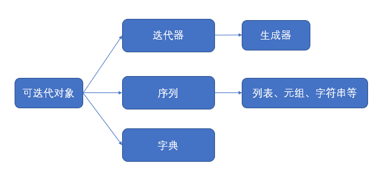

&ensp;&ensp;&ensp;&ensp;总结一下这次面试的一些题目。专业知识主要分这么几类：语言基础、框架基础、操作系统、计算机网络、数据结构以及算法编程。然后其他的还有一些职场问题、数学题、英语之类的就不展开详说了。
<!-- more -->

####  1. 语言基础(Python)
- 装饰器
装饰器这个对python来说简直必考啊，而且也必会。其实我以前一直以为装饰器是python的一个特性，后来才知道这是设计模式的一种。但是前阵子翻了翻设计模式的书发现，思想是很奇妙的，但是如果不应用到实际是感觉不到更精妙的地方的，所以以后工作的话要一遍实践一遍反复地读。就目前所了解的知识来说，装饰器就是一种给一个方法添加额外功能的作用。比如你要计算某个方法的运行时间，就普通思维来说就是在开头结尾获取时间然后相减。但是这样的话如果函数一多就会出现没必要的重复，但是如果用装饰器就能很好的解决。比如  
  ```python
    # coding:utf-8
    import time

    def calc_runtime(func):
        def inner(*args, **kwargs):
            start_time = time.time()
            result = func(*args, **kwargs)
            end_time = time.time()
            print('运行耗时:{0}'.format(end_time - start_time))
        return inner

    @calc_runtime
    def hello():
        a = 1
        for _ in range(10**8):
            a = a + 1

    hello()
  ```
  输出
  ```bash
    运行耗时:8.989534139633179
  ```

- 列表排序
给一个列表，用最简单的方法进行降序排序，这个简单应该是指代码最少吧，至少不用自己写排序了。
  ```python
    #coding: utf-8
    # code 1
    a = [1, 3, 2]
    a.sort()
    a.reverse()
    print(a)

    # code 2
    b = [1, 3, 2]
    x = sorted(b, reverse=True)
    print(x)
  ```
  输出
  ```python
    [3, 2, 1]
    [3, 2, 1]
  ```

- *args与**kwargs区别
首先,这个args和kwargs没有强制要求你用这两个变量，毕竟他们也不是关键字，真正起作用是`*`和`**`这两个东西，不过我们也介绍一下，字面意思，args是`arguments`可释义为未知参数，kwargs是`keyword arguments`可释义为关键字参数，为了好理解还是尽量用args和kwargs吧。`*`是把参数作为一个list或者tuple传入，`**`是把参数作为dict传入。所以，当你不确定有几个参数值会传入的时候用`*args`，当你不确定有几个形参传入的时候用`**kwargs`，看不懂的话就看代码吧。
  ```python
    # coding: utf-8

    def my_func(*args, **kwargs):
        for x in args:
            print('{0}'.format(x))
        for name, value in kwargs.items():
            print('{0}:{1}'.format(name, value))


    my_func('a', 'b', first='a', second='b')
  ```
  输出
  ```bash
    a
    b
    first:a
    second:b
  ```

- @staticmethod和@classmethod
python中方法可分这么几类，静态方法，类方法、属性方法，实例方法，普通方法。其中类方法和属性方法是需要特别注意一下的，其他的方法基本上和其他语言类似了。类方法的话你可以理解为结合了静态方法以及实例方法的一种，只不过类方法可以根据不同的类实例有不同表现，值得注意的是类方法中只能调用公有属性和方法，还是有点区别的。属性方法就是把方法当属性来用，具体看代码吧。
  ```python
    # coding: utf-8

    class MyMethod(object):
        str = 'hello'
        def common_way(self, x):
            print('common_way: {0}, {1}'.format(self, x))
        
        @classmethod
        def class_way(cls, x):
            print('class_way: {0}, {1}'.format(cls, x))
        
        @staticmethod
        def static_way(x):
            print('static_way: {0}'.format(x))
        
        @property
        def property_way(self):
            print('property_way: {0}, {1}'.format(self, self.str))

    way = MyMethod()
    way.common_way('test')
    way.class_way('test')
    way.static_way('test')
    way.property_way
  ```
  输出
  ```
    common_way: <__main__.MyMethod object at 0x000002396DD1E358>, test
    class_way: <class '__main__.MyMethod'>, test
    static_way: test
    property_way: <__main__.MyMethod object at 0x000002396DD1E358>, hello
  ```

- 迭代器和生成器
迭代器和生成器的话我建议网上搜索一下资料详细了解一下，这里贡献一张网上搞来的图。

简单来说，生成器是一种特殊的迭代器，自动实现了迭代器的`__iter__`和`__next__`方法。迭代器的内容一次性生成在内存中，而生成器只是保存了一种算法规律，每次调用`next`方法的时候再取得相应的内容，节约内存，生成器最直接的例子就是元组，其次是yield。下面代码奉上。
  ```python
    #coding: utf-8
    a = [x for x in range(10)]
    b = (x for x in range(10))
    print(type(a))
    print(type(b))
    print(next(b))
    print(next(b))

    def my_generator():
        c = 10
        while True:
            c = c + 1
            yield c

    c = my_generator()
    print(type(c))
    print(next(c))
  ```
  输出
  ```
    <class 'list'>
    <class 'generator'>
    0
    1
    <class 'generator'>
    11
  ```
- 简述__new__和__init__
  - __new__作用在实例创建的时候，__init__创建在实例初始化的时候（metaclass作用在类创建时）
  - __new__属于类方法，__init__属于实例方法
  - __new__方法返回一个创建的实例，__init__返回空

  ```python
    #coding: utf-8

    class MyClass(object):
        def __new__(cls, x):
            print('__new__')
            return super(MyClass, cls).__new__(cls)
        
        def __init__(self, x):
            print('__init__')
            self.x = x
            

    me = MyClass('100')
    print(me)
    print(me.x)
  ```
  输出
  ```
    __new__
    __init__
    <__main__.MyClass object at 0x00000205EF33ABE0>
    100
  ```
- Python垃圾回收机制  
  python垃圾回收机制分三种，引用计数，标记-清除，分代回收。这里我们也简单介绍一下，详细内容自己可以上网搜索分析。
  引用计数：当一个对象有新的引用时，计数器加1，当这个引用对象被删除时，计数器减1，到0时删除内存中的内容。
  标记-清除：引用计数方法无法消除循环引用的情况，所以就有了循环垃圾回收器，通过将原来的引用拷贝一份副本，类似java中的可达性分析，都是寻找根对象的一个过程，如果一个引用能找到根则保留，不能找到则标记删除，在一轮标记下来之后把所有标记的不能到达根的引用删除即可。
  分代回收：由于垃圾回收器会不定期扫描内存占用，每次扫描时总会有一些对象会存活很久，有些存活很短，对于那种存活很长的内存，我们没必要每次都扫描，因此python中设置了3代回收。对于每扫描多少次还存活的对象，放到下一代扫描频率稍微不频繁的。所以共需要维护3条链表。

  ```python
  import gc
  print(gc.get_threshold())
  ```
  输出
  ```
  (700, 10, 10)
  # 700是启动垃圾回收器的阈值，后面两个10代表每10次0代垃圾回收会有1次1代垃圾回收，每10次1代垃圾回收会有1次2代垃圾回收
  ```

####  2. 框架基础
- FLask中request实现
Flask中request基本原理实现这里我们也简述一下。我们在使用request的时候总是直接用这个变量就行了，那我们是如何拿到不同的数据的呢。首先，我们可以把数据存进线程里，然后通过id函数拿到不同线程的特征值，在每次请求进来的时候把对应线程放进栈顶，把request的引用指向栈顶即可，请求结束后pop掉栈顶数据即可。
- FLask中的上下文
Flask上下文是非常重要的，主要有4种，这里借用一下《Flask Web开发实战》中的表格简述一下。

|变量名|上下文类别|说明|
|-|-|-|
|current_app|程序上下文|指向处理请求的当前程序实例|
|g|程序上下文|替代python的全局变量用法，确保仅在当前线程中可用，用于存储全局数据，每次请求会重设|
|request|请求上下文|封装客户端发出的请求报文数据|
|session|请求上下文|用于记住请求之间的数据，通过签名的cookie实现|
 
  
####  3. 操作系统
- 进程、线程、协程之间的关系
  - 进程：操作系统资源分配的基本单位
  - 线程：操作系统调度的基本单位，同一进程下的线程共享进程所分配到的资源，但线程的私有栈、局部存储、寄存器不共享。
  - 协程：用户自己控制局部代码之间的切换，不需要陷入内核态。
- select,poll和epoll
这三个东西就是I/O多路复用的方法。select是直接循环每个fd（file descriptor，文件描述符），通过阻塞来寻找文件描述符。但是却有几个缺点。
  1. 单进程打开的fd数量受限（32位机器默认1024个，64位机器默认2048个）
  2. 线性扫描，效率低下
  3. 存放fd的数据结构太大，而且需要在内核态与用户态之间拷贝，开销大。
 而poll就只是解决了select第一个连接数的问题，采用了链表的形式，连接数一般不受限制。
 epool完美解决以上三个问题，通过callback回调的方式，只有活跃的fd才会主动发出事件通知。

- PV操作
这个翻操作系统课本吧，P操作申请资源，加入队列，V操作释放资源
- 内核态与用户态
这个也翻课本吧，当程序执行高层次的调用或者异常中断等操作时会从用户态陷入内核态，处理完后返回用户态。
- 简述常见的几种编码区别  
  - ASCII码：共有128个，用1个字节的低七位表示，可以用键盘输入且打印出来
  - GB2312：“信息技术中文编码字符集”，双字节编码，编码范围是 A1~F7，共包含682个字符，6763个汉字
  - GBK：“汉字内码扩展规范”，主要是为了拓展GB2312，加入更多的汉字。兼容GB2312
  - Unicode：国际组织制定的可以容纳世界上所有文字和符号的字符编码方案。目前的Unicode字符分为17组编排，0x0000至0x10FFFF，每组称为平面（Plane），而每平面拥有65536个码位，共1114112个。然而目前只用了少数平面。UTF-8、UTF-16、UTF-32都是将数字转换到程序数据的编码方案。
  - UTF-16：说到UTF 必须提到 Unicode ，ISO 试图创建一个全新的超语言字典，世界上所有的语言都可以通过这个字典来相互翻译。UTF-16 具体定义了Unicode 在计算中的存取方法。UTF-16 用两个字节来表示 Unicode 的转化格式，采用定长的表示方法，即不论什么字符都可以用两个字节表示。
  - UTF-8：UTF-16 存在存储空间浪费。UTF-8 采用了一种变长技术，每个编码区域有不同的字码长度。不同类型的字符可以由1~6 个字节组成。如果是一个字节，最高位为0，则表示这是1个ASCII字符，可见，所有ASCII编码已经是UTF-8了。

####  4. 计算机网络
- OSI七层模型
甩个图，具体看课本吧

- TCP/IP五层模型
甩个图，具体看课本吧

- TCP/UDP概述
  - TCP：有连接，可靠传输
  - UDP：无连接，不可靠传输
  - 其他的看课本
- 简述HTTP协议
HTTP协议：超文本传输协议（HyperText Transfer Protocol)是互联网上应用最为广泛的一种网络协议。主要被用于在Web浏览器和网站服务器之间传递信息。 HTTP 是基于 TCP/IP 协议的应用层协议。默认使用80端口。最新版本是HTTP 2.0，目前是用最广泛的是HTTP 1.1。默认端口80。
HTTPS协议：简单来说，可以理解为安全版的HTTP协议，基于TCP/IP协议和SSL/TLS协议之上的应用层协议。默认端口443。

- 简述常见HTTP方法

| 状态码       | 定义               |
| :-------- | :--------------- |
| 1xx 报告    | 接收到请求，继续进程       |
| 2xx 成功    | 步骤成功接收，被理解，并被接受  |
| 3xx 重定向   | 为了完成请求,必须采取进一步措施 |
| 4xx 客户端出错 | 请求包括错的顺序或不能完成    |
| 5xx 服务器出错 | 服务器无法完成显然有效的请求   |

- Cookie和Session

|      | Cookie                     | Session |
| :--- | :------------------------- | :------ |
| 储存位置 | 客户端                        | 服务器端    |
| 目的   | 跟踪会话，也可以保存用户偏好设置或者保存用户名密码等 | 跟踪会话    |
| 安全性  | 不安全                        | 安全      |

session技术是要使用到cookie的，之所以出现session技术，主要是为了安全。
  
####  5. 数据结构
- 数组
数组的主要优点是快速查询修改，可结合链表考察。
- 链表
链表的主要优点是删除增加方便，可结合数组考察。
- 树
树这个简直太重要了，什么都可以上树，猴子都可以爬树了你都不了解树，你怎么做的人吗。这个以后单独开篇文章咱们详细讨论一下。
  
####  6. 算法编程
- 找出1-1000000000以内位数上没有重复数字的所有数
这个面试官我也不知道他咋想的，他和我谈的时候我说用递归，他说怎么可能递归呢，就一个循环，我。。。好吧，先上代码看看效率我再说思想：
  ```python
    ans_list = list()
    nums = [0, 1, 2, 3, 4, 5, 6 ,7 ,8 ,9]
    flag = [0, 0, 0, 0, 0, 0, 0, 0, 0, 0]
    max_num = 10**9

    def get_num(num):
        if(num >= max_num):
            return
        for x in nums:
            if(flag[x] == 0):
                t_num = num * 10 + x
                if(t_num >= max_num):
                    continue
                ans_list.append(t_num)
                flag[x] = 1
                get_num(t_num)
                flag[x] = 0

    @calc_runtime
    def get_num1():
        for x in range(1, 10):
            ans_list.append(x)
            flag[x] = 1
            get_num(x)
            flag[x] = 0
        print(len(ans_list))

    @calc_runtime
    def get_num2():
        ans = list()
        for x in range(1, max_num):
            y = list(str(x))
            select = 1
            for z in range(len(y)):
                if(y.count(y[z]) > 1):
                    select = 0
                    break
            ans.append(x) if(select) else None
        print(len(ans))


    if __name__ == "__main__":
        # 我的递归
        get_num1()
        # 面试官的循环
        get_num2()
  ```
  由于`10^9`太大，我实在是等不了，所以咱们缩小到`10^5`和`10^7`看看效率差异
  输出
  ```
  10^5
    32490
    运行耗时:0.20588231086730957
    32490
    运行耗时:0.403275728225708
  10^7
    712890
    运行耗时:1.6770353317260742
    712890
    运行耗时:20.236406087875366
  ```
  当然，我的代码是有点垃圾，不过再怎么效率也是有提升的，用排列组合算算就知道递归的计算次数比循环小。我的思想也很简单，因为位数不重复，所以递归，每次递归时把当前用了的数标记，下次不用，递归回来的时候解除标记继续用。循环嘛，就暴力啦，很直白。这里我用到了装饰器计算时间，同时也有个内存管理的坑，幸好了解了一丢丢内存管理，不然就掉坑里了。

- 给一串字符串，找出最长回文的长度
回文必然马拉车(Manacher)算法啊，详情可以看我以前的博客[HDU 3068 - 最长回文(manacher)](http://woodcoding.com/?id=114)。
  ```c++
    #include <iostream>
    #include <cstdio>
    #include <cstring>
    using namespace std;
    #define MAX 110005
    int ans, lenr, lens, mx, id, pd[MAX*2];
    char res[MAX*2], str[MAX*2];
    void init(){
        lenr=strlen(res);
        str[0]='@';
        str[1]='#';
        for(int i=0;i<lenr;i++){
            str[i*2+2]=res[i];
            str[i*2+3]='#';
        }
        lens=lenr*2+2;
    }
    void manacher(){
        mx=0;id=0;ans=0;
        for(int i=1;i<lens;i++){
            if(mx>i)pd[i]=min(pd[2*id-i], mx-i);
            else pd[i]=1;
            for(;str[i+pd[i]]==str[i-pd[i]];pd[i]++);
            if(i+pd[i]>mx){
                mx=i+pd[i];id=i;
            }
            ans=max(ans, pd[i]-1);
        }
    }
    int main()
    {
        while(~scanf("%s", res)){
            init();
            manacher();
            printf("%d\n", ans);
        }
        return 0;
    }
  ```
- 给一串字符串，统计字符出现次数并从大到小排序
  ```python
    # coding: utf-8

    def solve(str):
        ans = dict()
        for c in str:
            if c not in ans:
                ans[c] = 1
            else:
                ans[c] += 1
        return ans

    def paint(ans):
        t_ans = sorted(ans.items(), key=lambda c: c[1], reverse=True)
        for val in t_ans:
            key = val[0]
            value = val[1]
            print('{0}:{1}'.format(key, value))

    if __name__ == "__main__":
        str = "Hello,World!"
        ans = solve(str)
        paint(ans)
  ```
- 手写单例模式
  - 使用__new__
  ```python
    class Singleton(object):
        def __new__(cls, *args, **kw):
            if not hasattr(cls, '_instance'):
                orig = super(Singleton, cls)
                cls._instance = orig.__new__(cls, *args, **kw)
            return cls._instance

    class MyClass(Singleton):
        a = 1
  ```
  - 使用装饰器
  ```python
    def singleton(cls):
        instances = {}
        def getinstance(*args, **kw):
            if cls not in instances:
                instances[cls] = cls(*args, **kw)
            return instances[cls]
        return getinstance

    @singleton
    class MyClass:
    ...
  ```

  就总结到这里吧，也不早了，早点休息明天回老家继续学习。其实还有一部分关于数学、英语、职场的问题我没写出来，不过也需要重视，可以自己去网上找找看吧。