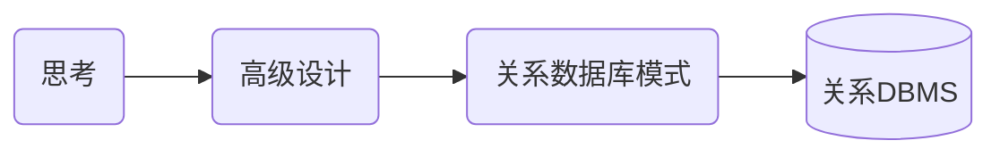
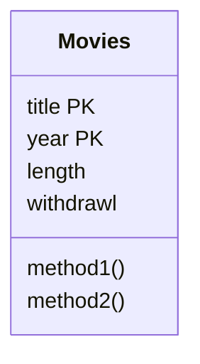

## 摘要

&ensp;&ensp;&ensp;&ensp;大学里学的数据库课程也差不多忘了（好像根本没怎么听，就只记得个笛卡尔积和几大范式了哈哈），所以就学习一下。当然，如果对离散数学没有任何认识的话还是建议先看离散数学，因为数据库中很多术语都在离散数学中有定义。

更新记录：  

- 2020-03-20： 开始记录
- 2020-03-26： 完成一、二、三章，把范式搞清楚就好办了
- 2020-03-27： 完成第四章，E/R图完成，第一部分理论就完成了，准备进入数据库程序设计部分。
- 2020-04-03： 完成第五章、第六章，基本上重点内容都已经记录到位，后面花个几天把尾巴补上。

## 待完成

- [x] 第一章 数据库系统世界
- [x] 第二章 关系数据模型
- [x] 第三章 关系数据库设计理论(含范式判断)
- [x] 第四章 高级数据库模型(含E/R图)
- [x] 第五章 代数和逻辑查询语言
- [x] 第六章 数据库语言SQL
- [ ] 第七章 约束与触发器
- [ ] 第八章 视图与索引
- [ ] 第九章 服务器环境下的SQL
- [ ] 第十章 关系数据库的新课题

<!-- more -->

## 第一章 数据库系统世界

&ensp;&ensp;&ensp;&ensp;本章节主要是介绍了一些关于数据库的基础概念。

### 1、数据库相关概念

- **数据库是什么？**
  
  本质上讲，数据库就是信息的集合。一般来讲，是指由DBMS所管理的数据的集合。  

- **关系型数据库与非关系型数据库区别**

  数据库系统将数据组织成表的形式呈现给用户，这种形式的数据表示称为关系。关系数据库就是采用了关系模型来组织数据的数据库。  

- **SQL是什么？**

  Structured Query Language，结构化查询语言，一种数据库查询和程序设计语言，用于存取数据以及查询、更新和管理关系数据库系统。

- **DB、DBMS、DBA是什么？**

  - DB：Database，即数据库
  - DBMS：Database Management System，即数据库管理系统。我们平时所说的mysql、mssql就是指的DBMS而不是DB
  - DBA：Database Administrator，即数据库管理员。是从事管理和维护数据库管理系统(DBMS)的相关工作人员的统称。

- **数据定义语言（DDL）是什么？**

  数据库模式定义语言DDL(Data Definition Language)，是用于描述数据库中要存储的现实世界实体的语言。  

### 2、数据库管理系统

- **DBMS如何执行查询操作？**

  数据库查询通过查询编译器完成SQL语法的分析与优化，语法送往执行引擎完成一系列小块数据请求，请求送往缓冲区管理器完成从二级存储（通常是磁盘）获取数据送入主存缓冲区。

- **简单了解数据库事务**

  事务是数据库管理系统执行过程中的一个逻辑单位，由一个有限的数据库操作序列构成。

- **事务的ACID是什么？**

  A(atomicity)：原子性，事务操作要么全部执行，要么全部不执行  
  I(isolation)：独立性，事务执行时如同没有其他事务同时执行一样。  
  D(durability)：持久性，一旦事务完成，该操作对数据库的影响是永久的。  
  C(consistency)：一致性，事务完成前后数据的完整性必须保持一致。  

## 第二章 关系数据模型

### 1、名词解释

- **数据模型(Data Model)**：数据模型一般用于描述数据库中数据的结构,也包含施加于数
据上的各种约束。通常，数据模型提供了一套规则描述數据上的各种操作，比如数据查
询和数据修改。

- **关系模型(Relational Model)**：关系是表示信息的表。属性位于每列的头部，每个属性
都有相应的域或者数据类型。行被称为元组，每一行都有一个分量与关系属性对应。

- **模式(Schema)**: 关系名和该关系所有属性的结合。多个关系模式形成一个数据库模式。
一个关系或多个关系的特定数据叫做关系模式或数据库模式的实例。

- **键(Key)**：关系上有一类很重要的约束，即由关系的一个属性或者一个属性集组成的
键。没有任何两个元组在组成键的所有属性上具有相同的值，虽然它们有可能在组成键
的部分属性上取值相同。

- **半结构化数据模型(Semistructured Data Model)**：在这种数据模型中，数据以树或者图的形式进行组织。XML是半结构化数据模型中的一个重要实例。

- **SQL**：SQL是关系数据库系统的标准查询语言。最新的标准是SQL-99。目前市面上的商
用数据库并没有完整的实现该标准，而只是实现了其中的一部分。

- **数据定义(Data Definition)**: SQL提供了定义数据库模式中元素的语句，可以利用
CREATE TABLE语句来声明一个存储的关系 (称作表)模式，定义其包含的属性集，各
属性的数据类型、默认值和键等。

- **模式修改(Altering Schema)**：可以利用ALTer语 句来修改数据库的一部分模式。 这些修
改包括在关系模式中增加或者删除属性，改变与某个属性相关联的默认值等。当然，
也可以利用DROP语句将整个关系或者其他模式元素删除。

- **关系代数(RelationalAlgebra)**：代数在关系模型的大多数查询语言中都有所体现。它
的基本操作有并，交、整、选择,投影、笛卡儿积、自然连接、链接及重命名等。

- **选择和投影(Selection and Projection)**：选择操作得到的结果是关系中所有满足选择条
件的元组。投影操作从关系中去掉不感兴趣的列，剩下的输出，形成最终结果。

- **连接(Join)**：通过比较两个关系的每一对元组来进行连接操作。在自然连接当中，把
那些在两个关系的共有属性上值相等的元组接合起来。在θ连接中，则是连接来自两个
关系的一对满足θ连接指定的选择条件的元组。

- **关系代数中的约束(Constraint in Rclational Algcbra)**: 许多常见的约束可以用某个关系
代数表达式被另外一个所包含的形式表达，或者用某个关系代数表达式等于空集的等价
形式表达。

### 2、数据模型

数据模型是用于描述数据或信息的标记，一般由三部分组成：

- 数据结构：一种物理数据模型，也称概念模型
- 数据操作：有限的可执行操作集，如CRUD。
- 数据约束：描述数据上的关系约束。

主流数据模型有：

- 关系模型
- 半结构化模型

### 3、关系模型

数据库表Movies

| title              | year | length | genre  |
| ------------------ | ---- | ------ | ------ |
| Gone with the wind | 1939 | 231    | drama  |
| star wars          | 1977 | 124    | scifi  |
| wayne's world      | 1992 | 95     | comedy |

以上面的关系为例：

- **关系名**：就是表名Movies
- **属性**：关系的列名如title、year等，由于关系上所有的属性是一个集合而不是列表，因此与排列顺序无关。
- **模式**：关系名和数据的集合构成的组合。如：Movies(title、year、length、genre)
- **数据库模式**：多个关系模式组成的集合。
- **元组**：每一行数组，如：(Gone with the wind, 1939, 231, drama )，由于关系是元组的集合，因此与元组的排列顺序也无关。
- **域**：元组的每个分量具有原子性，属于某种元素类型，如year属于integer，即为year分量上的域。
- **实例**：当前关系所有元组的集合称为当前实例。
- **键**：关系上的任何两个元组的值在键上的取值不同，比如我们平时说的主键id，也可以由多个属性结合成键，如这里的title和year可以组成成键。

### 4、代数查询语言

#### 什么是代数

  &ensp;&ensp;&ensp;&ensp;通常一门代数由一些操作符合一些原子操作数组成。如算数代数中的原子操作数是x和15这种，+、-、*、/这些是操作符。任何一门代数都可以把操作符作用在原子操作数上构造表达式。

#### 为何引入代数查询语言

  &ensp;&ensp;&ensp;&ensp;C++/JAVA这些语言已经足够强大，为何还要引入新的语言？答案非常让人惊讶，引入关系代数的原因竟然正是由于关系代数没有C++/JAVA这么强大的特性。在数据库中，我们使用一些简单的代数符号就可以用来表达我们对数据的所有操作。

#### 关系代数

- 操作数:
  - 代表关系的变量
  - 代表有限关系的常量
- 操作符：
  - 集合操作  
      交：$R∩S$  
      并：$R∪S$  
      差：$R-S$  
  - 投影（$π$）  
      其实就是过滤了一些属性得出的结果，  
      例如：$ π_{title,year,length}(Movies) $，就是把title、year、length这三列拿出来。  

      | title              | year | length |
      | ------------------ | ---- | ------ |
      | Gone with the wind | 1939 | 231    |
      | star wars          | 1977 | 124    |
      | wayne's world      | 1992 | 95     |

  - 选择($σ$)  
      就是过滤了一些元组得出的结果：  
      例如：$ σ_{length\geq100}(Movies) $ 的结果是：  

      | title              | year | length | genre |
      | ------------------ | ---- | ------ | ----- |
      | Gone with the wind | 1939 | 231    | drama |
      | star wars          | 1977 | 124    | scifi |

  - 笛卡尔积($×$)  
      笛卡尔积又叫叉积或者直接叫积，是一个有序对的集合。就是把两个关系的元组拼在一块，组成更长的元组。例如：  
      R：

      | A   | B   |
      | --- | --- |
      | 1   | 2   |
      | 3   | 4   |

      S：

      | A   | B   | C   |
      | --- | --- | --- |
      | 2   | 5   | 6   |
      | 4   | 7   | 8   |
      | 9   | 10  | 11  |

      R×S：

      | A   | R.B | S.B | C   | D   |
      | --- | --- | --- | --- | --- |
      | 1   | 2   | 2   | 5   | 6   |
      | 1   | 2   | 4   | 7   | 8   |
      | 1   | 2   | 9   | 10  | 11  |
      | 3   | 4   | 2   | 5   | 6   |
      | 3   | 4   | 4   | 7   | 8   |
      | 3   | 4   | 9   | 10  | 11  |

      **所以一个m行元组的R和一个n行元组的S的笛卡尔积有m*n个元组。**
  - 自然连接(join，$R⋈S$)  
      关系R和S中具有共同属性，且共同属性中值相等的元组配对构成新元组，可以一对多。
  - θ连接($R⋈{ _c}S$)  
      其实就是带筛选条件的自然连接。
  - 命名和重命名($ρ_{_{RS}(x, y, z)}(R×S)$)  
      将关系代数生成的结果重新命名

## 第三章 关系数据库设计理论(含范式判断)

&ensp;&ensp;&ensp;&ensp;本章主要介绍关系模式中的由于存在依赖导致的问题，以及如何用范式分解去解决问题。

### 1、名词解释

- **函数依赖(Functional Dependency, FD)**：函数依赖表示:若关系中的两个元组在某些属性
集合上一致，则它们在另-些属性集合上也必须一致。

- **关系的键(Key of a Relation)**： 关系的超键(superkey) 是可以函数决定该关系所有属
性的属性集合。若一个超键不存在任何能函数决定所有属性的真子集，则它是键。

- **函数依赖的推论(Reasoning About Functional Dependency)**: 存在一组规则，根据这些
规则可以推出在满足給定FD集的任意关系实例中，FD X→A成立。证明FD X→A成立的方法是计算X的闭包，使用给定FD来扩展X，直到它包含A.

- **FD集合的最小基本集(Minimal Basis for a set of FD's)**：对于任何FD集合，至少有一个
最小基本集，它是一个和原FD集合等价的FD集合(即两者相互蕴涵),右边是单个属性，
而且从中去除任一一个FD或从左边去除任一个属性后都不再和原集合等价。

- **Boyce-Codd范式(Boyce Codd Normal Form)**：若关系中的非平凡FD指明某个超键函数
决定一个或其他多个属性，则该关系属于BCNF。BCNF的主要优点是它消除了由FD引起的冗余。

- **无损连接分解(Lossless-Join Decomposition)**： 分解的一个有用性质是可以通过将分解得到的关系进行自然连接，来准确地恢复原始关系。任何一个分解都包含了原关系的所有元组，但若分解选择不当，则连接结果会包含不属于原关系的元组。

- **依赖保持分解(Dependency -Preserving Decomposition)**：分解的另一个很好的性质是可以通过检查在分解得到的关系上的FD来证明原关系上的所有函数依赖。

- **第三范式(Third Normal Form)**： 有时，分解到BCNF时无法具有依赖保持性质。3NF是
一种比BCNF限制较松的范式，它允许FD X一A (其中X可以不是超键，而A是键的成
员)的存在。3NF不保证消除所有由FD引起的冗余，但大多数情况下可以消除。

- **多值依赖(Multivalued Dependency, MVD)**：多值依赖表示关系中有两个属性集的值以所有可
能的组合方式出现。

- **第四范式(Fourth Normal Form)**：关系中的MVD也可能引起冗余。4NF同BCNF相似，
但也禁止存在左边不是超键的非平凡MVD。一个关系可以无损地分解为4NF关系集台。

### 2、函数依赖

#### 函数依赖的定义

|     | A1  | ... | An  | B1  | ... | Bm  | -   |
| --- | --- | --- | --- | --- | --- | --- | --- |
| t   | -   | -   | -   | -   | -   | -   | -   |
| u   | -   | -   | -   | -   | -   | -   | -   |

&ensp;&ensp;&ensp;&ensp;如上图所示，如果t、u两个元组在属性$A_1...A_n$上的值完全相同，那么他们在$B_1...B_m$上的分量值也相同，则存在函数依赖。该函数依赖形式可以记为：$A_1A_2...A_n→B_1B_2B_...B_m$，称“$A_1A_2...A_n$函数决定$B_1B_2B_...B_m$”。如果关系R中每个实例都能使一个给定的FD为真，则称R满足函数依赖$f$。通常一个FD的右边可能是单个属性，所以$A_1A_2...A_n→B_1B_2B_...B_m$也等价于：  

$$
A_1A_2...A_n→B_1\\
A_1A_2...A_n→B_2\\
...\\
A_1A_2...A_n→B_m\\
$$

- **完全依赖**：若属性集A决定B，且去除任何一个A集合中的属性后属性集A无法决定B，那么称其为完全依赖。
- **部分依赖**：若属性集A决定B，且去除某个A集合中的属性后属性集A仍然可以决定B，那么称其为部分依赖。

#### 键、超键、候选键

- **关系的键**  
  一个或多个属性集满足下面的条件：  
  1. 这些属性决定其他属性，即不存在两个元组具有相同的键
  2. 属性集$\{A_1,A_2...A_n\}$中没有任何属性都不能被其他属性或属性集所决定，即键是最小的。

  键也称为候选键

- **超键**  
  超键满足键的第一条规则，但是不满足第二条，因为超键不需要最小化，即属性集中只要包含了键中所有的属性就可以称为超键。超级键嘛，肯定要比键多啦。

#### 函数依赖规则

- **依赖推导**  
  通过一系列的推导规则，如传递规则，从而推断出新的FD集合。对于两个FD集合S和T，若他们的FD集合集合完全相同，则认为S与T等价，若满足T中所有FD的每个关系实例也满足S中的所有FD，则认为S是从T中推导出来的。

- **结合/分解**  
  FD的右边可以结合，也可以分解：
  分解：一个FD右边有多个属性时可以分解成左边相同，右边为单个属性。
  结合：多个FD左边相同，右边可以结合为多个属性。
  **注意：** FD的左边不能分解，因为分解后推导可能存在条件不充分的情况而导致错误。

- **平凡函数依赖**  
  FD的右边是左边的子集，则称为平凡FD。如$title, year → title$，即为平凡FD。存在一种中间状态，右边部分属性在左边出现，部分没有出现，那么可以把右边在左边出现的部分删除，以此进行FD化简，这种化简规则称为平凡依赖规则。

- **闭包**  
  即以FD左边的属性集为基础，利用这些属性集的组合进行FD推导（FD集合需要给出），能推出不在这里面的属性，并把这些属性加入到左边的属性集中，最终得出属性集的闭包。按平凡依赖规则，左边的属性集肯定能推出他自己，所以闭包的表示为：$\{A_1,A_2,...A_n\}^+$ 当$A_1,A_2,...A_n$是关系的超键时，$\{A_1,A_2,...A_n\}^+$为关系的所有属性的集合。

- **传递规则**  
  这个就简单了，就是如果有FD：A→B，B→C，那么也有：FD：A→C。当然，这里的A、B、C泛指集合，如果C中存在某些属性在A中出现，则可以利用平凡依赖规则将这些元素除去。
  
### 4、数据库模式设计

&ensp;&ensp;&ensp;&ensp;不好的数据库模式会带来冗余和相应的异常，因此一个良好的关系模式非常重要。一般都是引入范式进行分解。

#### 异常

&ensp;&ensp;&ensp;&ensp;当一个关系中包含过多信息时，会产生冗余等问题，称之为异常，异常的基本类型有：

- **冗余**：信息在多个元组中重复。
- **更新异常**：修改了某个元组中的信息却没有改变其他元组中相同的信息。
- **删除异常**：删除某元组集后导致某些属性信息丢失。

#### 分解

&ensp;&ensp;&ensp;&ensp;一般使用分解的方法来消除异常，分解应具有以下性质：

- **消除异常**：消除冗余、更新异常、删除异常
- **信息的可恢复**：可以从分解后的元组中恢复原始关系
- **依赖的保持**：分解后的关系进行连接重构获取的原始关系仍然满足原来的FD

#### chase检验

&ensp;&ensp;&ensp;&ensp;由于分解不能保证分解的各个关系重新连接后能得到原关系实例（就是说分解后的关系进行**自然连接**时得到的元组会比原来的多了或者少了），所以分解也分为无损连接和有损连接两种。chase检验就是用来检验分解是否是无损连接的。

算法举例：
假设有关系R(A,B,C,D)被分解为3个关系S1(A,D),S2(A,C),S3(B,C,D)。可以用以下图例来表示分解关系：

| A   | B   | C   | D   |
| --- | --- | --- | --- |
| a   | b1  | c1  | d   |
| a   | b2  | c   | d2  |
| a3  | b   | c   | d   |

每一行代表一种关系划分，加下标的值代表可以为任意值。假定分解给定的FD是A→B，B→C，CD→A。下面进行等值替换操作。

1. 由于第一行和第二行均有相同的A值为a，考虑FD：A→B，故有b2=b1，则可替换b2为b1，得：

    | A   | B                     | C   | D   |
    | --- | --------------------- | --- | --- |
    | a   | $\color{#fbbc05}{b1}$ | c1  | d   |
    | a   | $\color{#fbbc05}{b1}$ | c   | d2  |
    | a3  | b                     | c   | d   |

2. 由于第一行和第二行均有相同的B值为b1，考虑FD：B→C，故有c1=c，则可替换c1为c，得：

    | A   | B   | C                    | D   |
    | --- | --- | -------------------- | --- |
    | a   | b1  | $\color{#fbbc05}{c}$ | d   |
    | a   | b1  | $\color{#fbbc05}{c}$ | d2  |
    | a3  | b   | c                    | d   |

3. 再由于第一行和第三行均有相同的CD值为cd，考虑FD：CD→A，，故有a3=a，可替换a3为a，得：

    | A                    | B   | C   | D   |
    | -------------------- | --- | --- | --- |
    | $\color{#fbbc05}{a}$ | b1  | c   | d   |
    | a                    | b1  | c   | d2  |
    | $\color{#fbbc05}{a}$ | b   | c   | d   |

由于第三步之后没有值可应用FD进行替换，且出现了一行与元组(a,b,c,d)相匹配（即出现了一行不带下标的元组）。因此必为无损，反之为有损。

**思考：为什么chase检验有效？**  

&ensp;&ensp;&ensp;&ensp;其实我们每次FD替换就相当于进行了连接操作，最后得出的元组(a,b,c,d)就是原始关系。所以能找出这个元组就是能还原原始关系了，如果找不出说明这个分解的关系都没法还原那肯定是有损的了。（之前我还有点不明白，如果出现多的怎么办呢？写到这里才幡然醒悟，根本不会存在多的情况，这个要和有损连接中出现多的数据区分开来，这里讨论的是关系。）

**思考：为什么无损连接和依赖保持不能同时存在？**  

&ensp;&ensp;&ensp;&ensp;(这里我也学的不是很明白，书上只是给了一个例子，但是并没有给出证明过程，为什么这个例子不能是偶然的呢？挖坑，希望大佬解答。)

#### 多值依赖MVD

&ensp;&ensp;&ensp;&ensp;多值依赖一般是出现在基于A属性两个独立属性集B，C合并在单个关系中。 其定义：
对于R中每个在所有A属性上一致的元组对t和u，能在R中找到满足下列条件的元组v:

1. 在A属性上的取值与t和u相同:
2. 在B属性上的取值与t相同:
3. 在R中不属于A和B的所有其他属性上的取值与u相同。

说白了就是关系内存在多对多的关系，这个用第四范式解决即可。

### 5、范式综合

&ensp;&ensp;&ensp;&ensp;范式，NF(Normal Form)。这里简要说明一下各范式的定义，详解再结合例子单独写一篇，因为这个范式分解在数据库中的地位还是很高的。注意六大范式中的BCNF为什么不叫4NF呢，因为BCNF是对3NF的加强，可以理解为3NF Plus。

**1NF：**

概念：关系中的每个属性都不可再分（消除非主属性对码的部分函数依赖）。  
人话：就是表头属性是一行的，不存在你在excel表里面弄个两行然后某个属性再分解一下有两种类别这样。如下就不是1NF：

| 标题       | >        | 标识     |
| ---------- | -------- | -------- |
| -          | 类别     | 标签     |
| 这是标题啊 | 默认分类 | 测试标签 |

**2NF：**

概念：在满足1NF的基础上，非主属性必须完全依赖于候选码（在1NF上消除非主属性对码的传递函数依赖）。  
人话：就是非主属性必须完全依赖主键属性，由于主键属性可能由多个属性组成，如果去除主键属性中某些属性后，主键属性仍然可以决定非主属性，那么就不是2NF。

**3NF：**

概念：在满足2NF的基础上，任何非主属性不依赖于其它非主属性（在2NF基础上消除传递依赖）。  
人话：设主属性为A，存在非主属性B、C（B不是A的子集），若存在A→B，B→C，那么就不是3NF。

**BCNF：**

概念：在满足第三范式（3NF）基础上，任何非主属性不能对主键子集依赖（在3NF基础上消除主属性对候选码的部分函数依赖和传递函数依赖）。  
人话：就是说主键属性之间也要独立，不能由某些属性决定某些属性。

**4NF：**

概念：是Boyce Codd范式，并且没有多值依赖关系（在满足BCNF的基础上，消除非平凡且非函数依赖的多值依赖）。  
人话：就是删除关系内的多对多关系。

**5NF：**

概念：在4NF中并且不包含任何连接依赖关系并且连接应该是无损的，关系模式R依赖均由R候选码所隐含。（4NF的基础上，消除不是由候选码所蕴含的连接依赖）。  
人话：就是关系之间的连接完全由主键决定，不存在其他的键与其他关系之间存在连接。

## 第四章 高级数据库模型(含E/R图)

首先我们来看一下数据库从设计到实现的过程：



本章节主要就是讲何如设计数据库模型并能应用到关系数据库中。主要是使用了UML（统一建模语言）和E/R图（实体-联系图）对数据库关系进行设计。

### 1、名词解释

- **实体-联系模型(the Entity. Relationship Model)**:在E/R模型中 描述了实体集、实体集
之间的联系以及实体集和联系的属性。实体集的成员叫做实体。
- **实体-联系图(Entity-Relationship Diagram)**:分别用矩形、菱形和椭圆来画实体集、联
系和属性。
- **联系的多样性(Multiplicity of Relationship)**:二元联系可以是一-对一、多对一或多对多。
在一对-联系中，两个实体集中的任-一个实体至多只能与另-一个实体集中的一个实体关
联。在多对- -联系中，“多”边的每个实体至多只能与另-边的-一个实体关联。多对多
联系对个数无约束。
- **好的设计(Good Design)**:高效地设计数据库需要忠实地表达现实世界，选择合适的元
素(如联系、属性)，避免冗余一冗余是指一 -件事表示了两次，或者是用- -种间接的
或者是用过度复杂的方式表示一件事。
- **子类(Subclass)**: E/R模型用一个特殊的联系isa表示-一个实体集是另一个实体集的特例。
实体集可能连接在- -个层次体系中，其中每个子节点都是其父节点的特例。只要子树包
含根，那么实体集就可以有属于此层次的任意子树的组成部分。
- **弱实体集(Weak Entity Set)**: 需要用支持实体集的属性来确定它自己的实体。使用双边
的矩形和菱形来区分弱实体集。
- **统一建模语言(Unified Modeling Language)**: 在UML中，描述类和类之间的关联。类
好比E/R实体集，关联好比二元的E/R联系。特殊的多对一联系称为聚集和组合，并且这
些联系暗含了它们是如何转化为关系的。

- **对象定义语言(Object Definitive Language)**: 该语言用面向对象方式描述数据库的模式
设计。用户可以定义类，它有三种特性:属性、方法和联系。
- **ODL联系(ODL Relationship)**: ODL中的联系必须是二元的。它在其连接的两个类
(关联的两端)中通过名字来声明(同时声明其反向联系)。联系可以是多对多、多对一
或者一对一，取决于联系的类型是被声明为单个对象还是对象的集合。
- **ODL的类型系统(The ODL Type System)**: ODL允许构建类型，从类名和原子类型开始，
使用类型构建器为:结构、集合、包、链表、数组和字典等。

### 2、E/R模型

#### E/R图的基本标注

在实体-联系(Entity-relationship model，或er模型)模型中，数据的结构用图形化方式表示，即“实体-联系图”，用到**实体集**、**属性**、**联系**三个元素类型。  

- **实体集**
  实体是某种抽象对象，相似实体的集合形成实体集。这里的实体和编程中的“对象”非常相似，但是这个实体是静态的，不具有数据操作的功能，可以想象成只有属性没有方法的对象。并且在E/R图中我们使用**矩形**来表示实体集。  

- **属性**
  实体集具有属性，属性是这个实体集中所具有的性质，可以想象成对象中的属性，差不多了，在E/R图中我们使用**椭圆**来表示属性。

- **联系**
  联系是两个或多个实体集的连接，类似于一对一、一对多、多对多的连接关系，不过E/R图中的联系是有那么点多对多中的中间表的味道，可以单独拿出来命名。在E/R图中我们使用**棱形**来表示实体之间的联系。

- **角色**
  实体集和实体集之间用边连接，这个边称之为“角色”，有时候在多路联系的情况下，我们需要给边命名，以此表示清楚实体集与实体集或实体集与自己本身的关系。边的末端可能会出现箭头，这个箭头表示这一端**最多只能存在一个**。

- ***E/R图基本示例***

  ```mermaid
  graph TB;
  A[Stars]---D{Contracts};
  B[Movies]---D;
  D-- Studio of star -->C[Studios];
  D-- Producing studio -->C[Studios];

  a1([title])---A;
  a2([year])---A;
  a3([length])---A;
  
  b1([name])---B;
  b2([address])---B;

  C---c1([name]);
  C---c2([address]);
  ```

#### 设计原则

- **忠实性**：设计应当忠实于应用的具体要求。就是说建模原则是要符合现实世界规则，总不可能真把三头六臂插在人身上吧，这比喻也不是很恰当，头和臂是属性的话，三、六就是数据了，那后期装个机械手臂也是可以的啊哈哈。换个比喻，你对花草树木建模，那就不能说他拥有头了吧。

- **避免冗余**：应当小心对每件事只说一次（我觉得这书里面很多翻译真的很头疼啊）。前面好像也介绍过很多关于冗余的事了，这里不再重复了，“避免冗余”这个字面意思挺好理解的。

- **简单性**：除非有绝对需要，不要在你的设计中添加更多的成分。

- **选择正确的关系**：实体集可以用可以用多种联系连接起来，但是不要把每种可能的联系都写进来。

- **选择正确的元素种类**：对于特定的情形，有的东西适合做实体，有的东西适合做属性，不要搞混，不然会出现异常。例如本书中的电影公司就适合做实体，如果做属性会出现更新异常或者删除异常。

#### E/R图标注进阶

- **isa子类联系**
  在E/R图中，可以使用isa作为一种子类联系。我们使用三角形来表示。（mermaid语法画不了三角形图，我这里就不举例了，书上看看吧，就是把联系的棱形改为三角，然后名字都是isa）。子类的作用就自行联系面向对象中的子类吧。

- **键**
  每个实体集必须有一个键，一个实体集可以有多个键，isa中根实体集有用键所需的所有属性。这里我们对属性使用下划线来表示。

- **引用完整性**
  假设R是从实体集E到实体集F的联系，用圆箭头指向F，表示此联系从E到F中F实体必须存在。

- **度约束**
  在实体和联系的边上加上一个数字表示相关实体集中数目的约束，当然，可以用判断符号，如“<=10”。

- **弱实体集**
  一个实体集键由另一个实体集的部分或全部属性构成，这样的实体集称为弱实体集。我们用**矩形套矩形**的图形来表示这种实体集，边上的联系用**棱形套棱形**的图形表示（禁止俄罗斯套娃！！！）。例如：一个电影公司有几套拍摄班子命名为A、B、C，但是其他公司也有可能用同样的方式命名A、B、C，这时候命名不能作为拍摄班子的键，必须要同时给出电影公司才能确定一套拍摄班子，称这样的实体集为弱实体集（很作是吧，但是转换到数据库表里面我们用一个id主键就能把他变成非弱实体集，id还是万金油啊）。

#### E/R图到关系设计

初看起来，把er设计转换为关系数据库模式很直观:  

- 每个实体集可以转化为具有相同属性集的关系;
- 联系也用关系替换，替换的关系属性就是联系所连接的实体集的键集合。

虽然这两条规则在大多数情况下可用，但仍要考虑下面几种特殊情况:  

1. 弱实体集不能直接转化为关系。
2. “isa” 联系和子类要特殊对待。
3. 有时，需要把两个关系组合为一个关系，特别是当-个关系是从实体集E转化形成，而
另一个关系是由E到其他实体集的一个多对一的联系转化而来时，要考虑这种组合。

下面讨论关系的具体转换：

- **实体集**：直接把关系名和属性写出来，比如Stars(name, address)。
- **联系**：把联系两端的键以及联系自身的属性放一块，关系名就是联系名，如果出现属性重复，那就重新命名，比如name→studio_name。
- **关系组合**：有时候按照上面两种方法出来的关系可能不是很好，存在查询效率低的问题，这种情况经常出现在多对一和一对一的情况。这时我们可以把一的一边的主键放到多的一边而不需要再建立一个中间表降低查询效率了。
- **弱实体集**：当E/R图中有一个弱实体集时，需要做下面三件不同的事:
  1. 从弱实体集W得到的关系不仅要包含W的属性，还要包含相应支持实体集的键属性。支
  持实体集很容易辨认，因为它们由从W引出的支持联系(双边菱形)连接。
  2. 与弱实体集W相连的联系，经转化后所得的关系必须包含W键属性，以及对W键有贡献
  的实体集属性。
  3. 然而，一个支持联系R (它是从弱实体集W指向支持实体集)不必被转化为关系，因为由多对一联系R转化得到的关系的属性可以是W的属性，也可以与W的关系模式进行组合(在R有属性的情况下)。
- **isa子类**：isa子类转换有三种观点：
  1. 遵照er观点：即父类子类都创建关系，子类要包含父类的键，如B、C是A的子类，那就创建A、B、C三个子类，而且B、C中有A的键。
  2. 把实体看做属于单个类的对象：就是每个类都创建一个关系，父类子类都要，而且重复的子类还得加起来弄一个，并且子类拥有父类的所有属性。
  3. 使用空值：就是父类子类属性放一块，然后没有的属性给null就行了。
  以上三种方法各有各的优缺点，有的冗余多，有的查询效率高，就看实际应用选择了。

### 3、UML建模

#### UML简介

&ensp;&ensp;&ensp;&ensp;UML (统一建模语言，Unified Modeling Language)最初是开发用来在面向对象风格中作为描述软件设计的一种图形化的标注。它现在已经做了一些扩展和更改，可以作为一种流行的数据库设计描述的标注。

#### UML标注

&ensp;&ensp;&ensp;&ensp;UML中的类与er模型中的实体集类似，但是图形标注上有很大差别。如下图显示了与er实体集Movies对应的类。一个类框分为三个部分。顶部是类的名字，中间是它的属性，就像是一个类的实例变量一样。在Movies类中，有title, year, length和genre属性，属性后面加PK代表键。底部是方法。er模型和关系模式都不提供方法。然而这是一个重要的概念，通常出现在现代的关系系统中，称作“ 对象关系”DBMS。



#### UML关联

- **普通关联**：两个类之间画条线，联系名写线下面。连接端点用两个数字如`0..*`表示这端的对象数量约束上下限。`*`表示无限制，没有标签代表`1..1`，注意两个端点都要写。如下图：

  ```mermaid
  classDiagram
    Studios "0..1" -- "0..*" Movies : Owns
    Stars "0..*" -- "0..*" Movies : Stars-in
  ```

注意这里的数量约束已经表达了我们前面说的E/R图中的弯箭头的完整性约束。

- **自关联**：一个关联的两端可以连接同一个类，这样的关联称为自关联。为了区分一个他在自关联中表现的不同角色，还要给两端分别起个不同的名字。

- **关联类**：在两个类之间的线上加一个类，就称作关联类，和E/R图的也很类似。
- **子类**：UML允许一个类C有4个不同的子类：
  1. 完整对局部(Complete versus Partial)。 每个在类C中的对象是否是某个子类的一个成员?如果是，子类是完整的;否则，它们是局部的或者不完整的。
  2. 分离对重叠(Disjoint versus Overlapping)。 子类是分离的(Disjoint) (一个对象不能在两个子类中)吗?如果-一个对象可以在两个或多个子类中，那么子类可以称为是重叠的(Overlapping)。

  简单来说，完整对局部，说的就是父类和子类的关系，一般父类的对象可能是局部的，子类对象是完整的，因为父类可能会少一些子类的属性。分离对重叠就是子类和子类之间的关系，如果一个对象可以被两个子类表达那就是子类重叠（设想一下属性相同而方法不同？）。  
  子类的表示方法为：连一条线到父类，在父类端画个空三角箭头。

#### 聚集与组合

&ensp;&ensp;&ensp;&ensp;对于多对一的关联有两个特殊的标记，它们的含义相当微妙。--方面，它们影响了面向
对象的编程风格，通常对于一个类在它的属性之间都有到其他类的引用。另一方面，这些特殊的标注确实约束图如何转化为关系。

- **聚集(aggregation)**：在两个类之间的一条线，这条线的末端是一个空的菱形。菱形的含义是那端的标注一定要为0..1， 也就是说，聚集是-一个从这端的类到菱形端类的多对一的关联。尽管聚集是一个关联，但不必对它命名，因为名字在关系的实现中不会被用到。
- **组合(composition)**：与关联相似，但在菱形端的标注一定要为1..1。 也就是说，与菱形对应相连的类的每个对象都要与菱形端的-一个对象相连接。组合的菱形是实心的黑色。
  如下图：

  ```mermaid
  classDiagram
  classA "1..*" --o classC : aggregation
  classB "0..1" --* classD : composition
  ```

### 4、UML图到关系设计

- **类**：对于每个类，创建一 个关系，关系的名为这个类的名字，关系的属性就是这个类的属性。
- **关联**：对于每个关联，创建-一个名字为关联名的关系。关系的属性是两个连接类的键属性。如果恰巧两个类的属性名字相同，那么适当地重命名它们。如果有一个关联类附在这个关联上，那么在这个关系的属性中包含那个关联类的属性。
- **子类**：如果层次的每一层都是分离的，那么建议使用面向对象方法。如果层次在每一层既是完整的又是分离的，那么任务相对简单。如果使用面向对象的方法，那么只要为层次中叶子节点的类构建关系。如果层次很大并且在某些或者所有的层上是重叠的，那么er方法是合适的。可能会需要很多的关系使得关系数据库模式变得臃肿。
- **聚集与组合**：聚集与组合都是多对一类型的关联，在关系数据库模式中表示它们的方法可以是像普通关联做的那样进行转换。但是有些聚集与组合的实现会特殊一点，比如非棱形端是一个类的子类。所以建议聚集与组合用如下方式处理：不为聚集与组合构建任何关系，为非菱形端的类添加菱形端类的键属性。在聚集情况下(不是组合),这些属性可以为空。
- **弱实体集**：在UML的标注中没有提到与er模型中双边标注相对应的弱实体集。其实没有什么必要。
原因是，与er不同，UML遵循面向对象系统的传统，每个对象都有自己的对象标识。所以化关系的时候和关联化关系没啥区别。如果一定要标识一下，那就拿出来做个类，然后在端点加个小方块写上PK二字即可。

### 5、ODL语言

&ensp;&ensp;&ensp;&ensp;ODL (对象定义语言，Object Definition Language)是- -种基于文本的使用面向对象术语描述数据库结构的语言。像UML一样，类是ODL中的核心概念。就像UML类一样, ODL中的类具有名字、属性和方法。联系与UML的关联类似，但是在ODL中它不是一个独立的概念，而是可以作为特征的附加成员嵌入到类中。  
&ensp;&ensp;&ensp;&ensp;这个东西和编写模型代码类差不了多少，这里就不多BB了。

## 第五章 代数和逻辑查询语言

前面介绍过简单地代数查询语言，这章扩展到包上进行操作，并且引入Datalog进行查询。

### 名词解释

- **分组和聚集(Grouping and Aggregation)**: 聚集操作对关系的一列加以汇总。典型的聚
集操作是求和、求平均、求最小值和最大值。分组操作算符允许对某个关系的元组按着
它们在一个或者多个属性上的值分组，然后进一步 对每个组进行聚集计算。
- **外连接(Outerjoin)**: 两个关系的外连接是先执行这两个关系的连接。然后，那些悬浮
的元组(不能跟任何元组匹配的元组)用oul1值补齐后，也加入到结果当中。
- **Datalog**:这种逻辑形式允许在关系模型上编写查询。在Datalog中， 可以编写规则，规
则的头部谓词或关系根据子目标组成的主体来定义。
- **原子(Atom)**:规则头部和子目标都是原子，原子由一个应用于若千个参数(可选为否
定)的谓词组成。谓词可以表示关系或算术比较(例如<)。
- **IDB和EDB谓词(IDB and EDB Predicate)**: 某些谓词对应于已存储的关系，被称为
EDB (扩展数据库)谓词或称为关系。另-种谓词称为IDB (内涵数据库)谓词，是由
规则定义的。EDB谓词可以不出现在规则头部。
- **安全规则(Safe Rule)**:一般说Datalog规则是 安全的，是指规则中每个变敏都出现在主体的.
些非否定关系子日标中。安全规则保证:如果EDB关系是有限的，那么IDB关系也将是有限的。

### 包上的关系操作

#### 概念

&ensp;&ensp;&ensp;&ensp;把关系看做包（多集，multiset）而不是集合的话，一个元组就可以在关系中多次出现。

#### 为何采用包？

&ensp;&ensp;&ensp;&ensp;商业DBMS实现的关系都是包而不是集合，因为基于包的关系会使得一些关系操作的实现效率更好，例如：

- 两个包关系的并操作，可以简单地将一个关系的所有元祖复制到另一个关系，而不必消除两个关系当中的重复元组。
- 当在集合关系上投影时，需要逐个比较确保投影中相同元组只出现一次，而基于包就可以简单地投影每个元组加入到结果中而不必做比较操作，数据量大的时候可以节约大量的操作时间。

#### 关系操作

&ensp;&ensp;&ensp;&ensp;包的关系操作也有并、交、差、投影、选择、笛卡尔积、连接等操作，与前面提到的操作也是极为相似，唯一不同的是包中允许重复，所以可以把包中重复的元组看做是两个不同的元组进行操作，这样的话操作过程就和集合的操作没有什么区别了。

### 关系代数的扩展操作符

#### 消除重复（δ）

&ensp;&ensp;&ensp;&ensp;消重复操作符(duplicated-elimination operator)δ把包中的重复元素去掉，只保留一个
拷贝在关系当中。有时候需要用一个算子把包转化为集合。为此用δ(R)来返回一个没有重复元组的关系R。

#### 聚集（SUM、AVG、MIN、MAX、COUNT）

&ensp;&ensp;&ensp;&ensp;聚集操作符(aggregation operator)，例如求和或者求平均值。这些不是关系代数的操
作，但却是被分组(grouping) 操作符所使用(下面会讲到)的操作。聚集操作符应用到关系的属性(列)上， 比如说是求和操作，就把这一列的所有值加起来求和计算出结果。

- **SUM**产生一列的总和，得到的是一个数字值。
- **AVG**产生一列的平均值，结果也是数字值。
- **MIN和MAX**，当用于数字值列的时候，分别产生这一列中最小和最大值;当应用于字符值列的时候，分别产生的是字典序的第一个和最后一个值。
- **COUNT**产生一列中的“值”的数目(并不一定指不同的值)。同样，COUNT应用于一个关系的任何一个属性的时候，产生的是这个属性的元组的数量，包括重复的元组。

#### 分组（γ）

&ensp;&ensp;&ensp;&ensp;分组操作(grouping) 根据元组在一个或者多个属性上的值把关系的元组拆分成“组”。这样，聚集操作就是对分好组的各个列进行计算。这给我们提供了在经典关系代数表达式中不能表达的多个查询的描述方式。分组操作符(grouping operator) γ是组合了分组和聚集操作的一个算子。下面给出一个分组的例子：  

$$
γ_{starName,MIN(year)→minYear,COUNT(title)→ctTitle}(StarsIn)
$$

这里就是在StarsIn表中以starName分组，分组后计算每个组中最小的year并重命名为minYear，统计title的数量并重命名为ctTitle。

**思考** δ操作其实是γ操作的特殊情况
**思考** 分组前进行排序会不会有性能上的提升

#### 扩展投影（A+B→X）

&ensp;&ensp;&ensp;&ensp;扩展投影(extended projecion)是普通π操作（投影操作）符上增加了一些增强功能的算子。它可以将变量关系的列作为参数进行计算，并产生新的列。其实就是在普通投影操作上加了→符号，以此对关系上的各个分量进行计算操作并产生新的投影。如：  

$$
π_{A,B+C→X}(R)
$$

上面就是一个将R进行扩展投影的操作，A列直接投影，B列加C列相加投影成X。

#### 排序算子（τ）

&ensp;&ensp;&ensp;&ensp;排序算子(sorting operator) τ把一个关系变成一个元组的列表，并根据一个或者多个
属性来排序。这个操作使用时要心中有数，因为一些关系代数操作不能作用在列表上。选择
操作或投影操作可以对列表运算，并且其结果还保持列表中元素的顺序输出。例如：

$$
τ_{C,B}(R)
$$

上面就是在关系R上对C进行排序，如C相同则按B来排序。

#### 外连接

&ensp;&ensp;&ensp;&ensp;外连接算符(outerjoin operator) 是连接算符的变体，它防止了悬浮元组的出现。悬浮元组的存在有时不能完整表示关系，在外连接的结果中，悬浮元组用null符号⊥补齐，这样悬浮元组就可以在结果当中被表示出来。

外连接共有三种（完犊子，外连接符打不出来？这里用英文表示了，具体符号看书吧）：

- R OUTER JOIN S：R和S做自然连接，然后把R和S中的元组加入到结果，不存在的值用⊥符号填充
- R LEFT JOIN S：R和S做自然连接，然后把左边R中的元组加入到结果，不存在的值用⊥符号填充
- R RIGHT JOIN S：R和S做自然连接，然后把右边S中的元组加入到结果，不存在的值用⊥符号填充

### 关系逻辑

&ensp;&ensp;&ensp;&ensp;作为另外一种基于代数的抽象查询语言，可以用逻辑形式来表示查询。逻辑查询语言Datalog (database logic) 由if-then规则组成。 这些规则表示:从某个关系的特定元组的组合可以推断出另一些元组必定满足另一关系，或者满足查询的结果。

#### 谓词和原子

&ensp;&ensp;&ensp;&ensp;关系在Datalog中由谓词(predicate) 表示。每个谓词拥有固定数目的参数，一个谓词和它的参数一起被称为原子(atom)。原子的语法就像传统编程语言中函数调用的语法。例如，$P(x1，x2, .. xn)$即是一个由谓词P和参数$x1, x2, .. xn$组成的关系原子。算术原子是对两个算术表达式作比较，例如$x<y$或$x+1≥y+4*z$。算术原子和关系原子都将所有出现在原子中的变量值作为参数，并且都返回一个布尔值。  

&ensp;&ensp;&ensp;&ensp;实质上谓词就是一个返回布尔值的函数名。如果R是一个包含n个固定顺序的属性的关系，那么也可以用R作为对应这个关系的谓词名。如果$(a1, a2,... an)$是满足R的元组，那么原子$R(a1, a2, .,. an)$的值为TRUE，否则原子的值为FALSE。注意，谓词定义的关系是通常都是用来处理集合关系，把Datalog扩展到包时操作相同，不过就是重复的元组不进行消除。
例如：

| A   | B   |
| --- | --- |
| 1   | 2   |
| 3   | 4   |

那么R(1, 2)、R(3, 4)为TRUE，其他任意R(x, y)都为FALSE。

#### Datalog规则和查询

&ensp;&ensp;&ensp;&ensp;与经典关系代数类似的操作在Datalog中称作规则(rule)， 它包括:

1. 一个称为头部(head) 的关系原子:
2. 符号$ \leftarrow $，经常读作“if” ;
3. 主体(body) 部分，由一个或多个称为子目标(subgoa]) 的原子组成。原子可以是关
系原子或算术原子。子目标之间由AND连接，任何子目标之前都可随意添加逻辑算子NOT。

例如：  
$$ LongMovie(t,y)←Movies(t,y,l,g,s,p) \quad AND \quad l≥100 $$

**注意**：Datalog中如果某个变量只出现以此，那么可以简写为`_`，所以以上规则等同于：  
$$ LongMovie(t,y)←Movies(t,y,l,\_,\_,\_) \quad AND \quad l≥100 $$

#### Datalog规则

&ensp;&ensp;&ensp;&ensp;在规则中使用变量还是有限制的，该限制是要使得一条规则的结果是一个有限的关
系，从而包含算术子目标或否定(negated) 子目标(前面有NOT算子)的规则具有直观的意义，
这个限制条件称作安全(safety) 条件，即:

- 每个在规则中任意位置出现的变量都必须出现在主体的某些非否定的关系子目标中。

尤其是任何在规则头部、否定关系子目标或任意算术子目标中出现的变量，也必须出现在主体的非否定的关系子目标中。

例如，下面的规则有三处违反安全条件:  

$$ P(x,y)←Q(x,z) AND NOT R(w,x,z) AND x<y $$

1. 变量y出现在头部但不在主体的任何非否定关系子目标中。注意，出现在算术子目标
$x<y$中的y并不能有助于把y的值限定在有限集合内。只要对应w, x, z值的a, b, c满足前两个子目标，就必须增加无限多个d>b元组(b, d)到头部关系P。
2. 变量w出现在-一个否定的关系子目标中，但不在非否定的关系子目标中。
3. 变量y出现在一个算术子目标中，但不在非否定的关系子目标中。

**其实就是说凡是你用来做原子操作的变量或者在头部出现的变量就必须出现在没有带否定NOT的关系当中。**

#### 扩展谓词和内涵谓词

- 扩展谓词(Extensional predicate):这种谓词的关系存放在数据库中。
- 内涵谓词(Intension predicate):这种谓词的关系是由一一个或多个Datalog规则计算出来。

**区别**：
&ensp;&ensp;&ensp;&ensp;这两种谓词之间的区别等同于关系代数表达式的操作数与关系代数表达式计算出的关系之间的区别。前者，关系代数表达式操作数是“可扩展的”(也就是说，通过它的扩展定义关
系，也即“ 关系的当前实例”的另一命名)；后者,关系代数表达式计算出的关系可以是最终
结果，也可以是对应某些子表达式的中间结果，这些关系是“内涵的”(即是由程序员的“意
图”决定)。

### 关系代数与Datalog

&ensp;&ensp;&ensp;&ensp;基本关系代数描述的每一个表达式都可以用Datalog查询表达。而在扩展关系代数中的操作，如分组和聚集，则不能用Datalaog表达。类似地，Datalog不支持包操作，比如消重复。任何单个Datalog规则都可以用关系代数表达。也就是说，用基本关系代数表达的查询产生的元组与这个Datalog规则产生的头部关系元组相同。可是，当考虑Datalog规则集合时，情况有所变化。Datalog可以表达递归，而关系代数不可以。

## 第六章 数据库语言SQL

本章介绍SQL的基础查询语言和数据库修改语句。同时还要介绍数据库系统的基本工作单位——“事务” 的概念。这些内容虽然比较粗略，但也能让读者对数据库操作的互相影响及其引起的问题有一个初步的认识。对于本章节的学习，如果平时写代码和数据库打交道比价少的看起来吃力的话，建议还是结合上机与书本例子进行学习（像我这种接触过又不很熟的半吊子看起来还是不吃力的:stuck_out_tongue_closed_eyes:）。  
下面给出一个书上的数据库模式的例子，后面的SQL操作全部围绕这个模式进行：

>Movies (title, year, length, genre, studioName, producerC#)
StarsIn (movieTitle, movieYear, atarNane)
MovieStar (name, address, gender, birthdate)
MovieExec(name, addres, cert#, netHorth)
Studio(name, address, presC#)

### 名词解释

- **SQL**:SQL语言是关系数据库系统使用的主要查询语言。目前最新标准是SQL-99或SQL3。商业系统通常和SQI标准略有出入。
- **select-from-where查询(select-from- where Query)**: SQL查询最常用的形式是select-
from-where。它允许使用几个关系的积(在FROM子句中)、对结果元组施加过滤条件(在WHERE子句中)，并产生需要的字段(SELECT子句)。
- **子查询(Subquery)**: sclect- from where查询也能在其他查询中的WHERE子句或F ROM子句中作为子查询使用。操作符EXISTS、IN、 ALL和ANY都可以作用在WHERE子句中子查询形成的关系_上，并形成布尔值表达式。
- **关系上的集合运箅(Set Operation on Relation)**: 可以通过使用保留字UNION、 INTERSECT和EXCEPT分别连接关系或者产生关系的查询，达到实现关系的并、交和差的操作。
- **连接表达式(Join Expression)**: SQL提供如NATURAL JOIN这 样的操作符作用在关系上，可以看作将其看作是一一个查询或在F ROM子句中定义的-一个新关系。
- **空值(Nul] Value)**: SQL在元组的字段值没有指定具体值的时候，提供-一个特殊的值NULL。NULL的逻辑和算术运算规则都比较特殊。任何值和NULL值比较的结果都是布尔值UNKNOWN，即使该值也是NULL值。UNKNOWN值也能在布尔运算中出现，但把它看作处于TRUE和FALSE之间的-一个值。
- **外连接(Outerjoin)**: SQL提供一个OUTER JION操作符连接关系。 连接结果中包括来自连接关系的悬浮元组。结果关系中悬浮元组被填上NULL值。
- **关系的包模型(the Bag Model of Relation)**: SQL实际上把关系看作装满元组的包而不是元组的集合。可以使用DISTINCT保留字来消除元组重复，而保留字ALL在某些不认为关系是包的情况下允许结果是包。
- **聚集(Aggregation)**:关系中某列的值可以通过使用保留字SUM、AVG (平均值)、MIN、MAX和COUNT进行统计(聚集)。 在进行聚集操作前元组可以通过GROUP BY进行分组。 利用保留字HAVING可以消除某些分组。

### 数据类型

先介绍SQL系统支持的基本数据类型。关系中所有的属性都必须有一个数据类型。

1. **可变长度(VARCHAR)或固定长度字符串(CHAR)**：类型CHAR(n)表示最大为n个字符的固定长度字符串。VARCHAR(n)也表示最多可有n个字符的字符串。它们的区别与具体实现有关。一般来说，CHAR类型会以一些短的字符串来填充后面未满的空间来构成n个字符，而VARCHAR会使用一个结束符或字符长度值来标志字符串的结束，后面未满的空间不会做填充。

2. **固定或可变长度的位串(BIT)**：位串和字符串类似，但是它们的值是由比特而不是字符组成。
类型BIT(n)表示长为n的位串。BIT VARYING(n)表示最大长度为n的位串。

3. **逻辑类型BOOLEAN**：该类属性的可能值是TURE、FALS E和UNKNOWN。

4. **整数INT和INTEGER (两者为同义词)**：类型SHORTINT也表示整数，但是表示的位数可能小些，具体取决于实现。(类似C语言中的int和short int)。

5. **浮点值FLOAT和REAL (两者为同义词)**：需要高精度的浮点类型可以使用DOUBLE、PRECISION。SQL还提供指定小数点后位数的浮点类型。例如DECIMAL(n, d)允许可以有n位有效数字的十进制数，小数点是在右数第d位的位置。例如0123. 45就是符合类型ECIMAL(6, 2)定义的数值。NUMERIC几乎是DECIMAL的同义词，尽管它们存在某些依赖于实现的小差别。

6. **日期(DATA)和时间(TIME)**：这些值本质上是字符串的--种特殊形式。实际上可以把时间和日期强制转换成字符串类型。反之也可以把某些特定格式字符串转换为日期和时间。

### 简单查询

&ensp;&ensp;&ensp;&ensp;SQL中最简单的查询是找出关系中满足特定条件的元组，这种查询和关系代数中的选择操作类似。和几乎所有的SQL查询类似，简单查询使用代表SQL特点的三个保留字SELECT、FROM和WHERE来表示。例如：

```sql
SELECT *
FROM Movies
WHERE studioName='Disney' AND year = 1990;
```

- FROM 后面的是关系名；
- WHERE 后面的是查询条件，就像关系代数中的选择，当然where可以省略，这样查的就是所有；
- SELECT 后面是选择结果中出现的属性，其实就是投影，`*`代表所有属性；

&ensp;&ensp;&ensp;&ensp;所以上面的查询语句就是：从Movies表中查询工作室名为Disney并且年份为1990的元组并且显示所有的属性。

**Tips1**： 发现上面的一丝丝不对劲了没？我们写语法的时候是SELECT、FROM再WHERE，但是我们解释的时候是FROM再WHERE再SELECT。有没有发现对于我们来理解的话后面这种顺序会好一些呢？至于为什么写的时候要按前面顺序写？大概是为了符合代数查询的顺序吧。
**Tips2**：SQL语法中大小写是不区分的，所以大小写都是正确的语法，不过习惯上进行大写便于阅读（虽然不区分大小写但是只有大写是保留字而其他的如from、fRom这些都不是保留字，至于区别是啥目前还没遇到，以后再补充）！

- **投影**：
  在SELECT后面把关系中具体的属性列出来就是投影操作了。而且对这些投影的属性还可以进行一些简单计算和重命名操作。比如：

  ```sql
  SELECT title, length * 0.016667 AS lengthHours
  FROM Movies;
  ```

  以上就是把title、length投影出来并且把length*0.016667后更名为lengthHours
- **选择**：
  关系代数中的选择操作符在SQL中是通过SQL的WHERE子句表示。WHERE 子句中的表达式(包括条件表达式)和普通的计算机语言(如C和Java)中的表达式类似。可以通过值比较运算来建立表达式，比较运算使用六个常用的比较运算符: `=、<>. <、>、<=和>=`。最后四个运算符与C语言中的相同，而<>在SQL中表示“不等于”(在C语言中是!=)，=在SQL中表示“等于”(在C语言中是==)。例如：

  ```sql
  SELECT title
  FROM Movies
  WHERE (year > 1970 OR length < 90) AND studioName = 'MGM' ;
  ```
  
- **字符串比较**：
  当使用如<或>=等比较运算符对字符串作比较运算时，实际上比较的是它们的词典顺序
  (如字典顺序或字母表顺序)。也就是说，如果字符串SA：a1a2 .. an和字符串SB:b1b2... bm是两个字符串，当$a_1<b_1$时,或者$a_1=b_1$且$a_2<b_2$时，如此下去，则SA小于SB。如果$n<m$并且$a1a2...an=b1b2...bn$，则称字符串SA小于SB，也就是说第一个字符串正好是第二个字符串的一个前缀。

- **模式匹配**：
  SQL也提供了一种简单的模式匹配功能用于字符串比较，类似糊查询，如`s LIKE P`或``s NOT LIKE P``。其中s是一个字符串，p是模式(pattern), 即一个可能使用了两个特殊字符`%`和`_`的字符串(如果要查询的字符串中含有%或_，则需转义，而且''代表一个')。p中普通字符仅能匹配s中与其相同的字符，而%能匹配s中任何任意长度(包括零长度)的字符串, p中的_则能匹配s中任何一个字符。该表达式的值为真当且仅当字符串s匹配模式p。下面是用ESCAPE保留字用来指定转义的例子（SQL中没有指定转义字符，所以用ESCAPE代替）：
  
  ```sql
  s LIKE 'x%%x%' ESCAPE 'x'
  ```

- **日期时间**：
  SQL的实现版本通常将时间和日期作为特殊的数据类型。其值常常用不同形式表示，如05/14/1948或14 May 1948。
  
- **空值**：
  SQL允许属性有一个特殊值NULL，称作空值。对于空值有许多不同的解释：未知值、不适用的值、保留的值。在WHERE子句中，要考虑元组中的空值可能带来的影响。当对空值进行运算时有两个重要的规则要记住。
  1. 对NULL和任何值(包括另-一个NULL值)进行算术运算(如x和+),其结果仍然是空值。
  2. 当使用比较运算符，如=或>，比较NULL值和任意值(包括另一个NULL值)时，结果都为UNKONWN值。值UNKNOWN是 另外一个与TRUE和FALSE相同的布尔值。后面将简介地介UNKNOWMN值的操作。可是，要记住，虽然NULL也是一个可以出现在元组中的值，但是它不是一个常量。因此，虽然可以利用上面的规则对值为NULL的表达式进行运算，但是不可以直接将NULL作为一个操作数。

- **布尔值**：
  比较运算结果要么是TRUE要么是FALSE,并且这两种布尔值可以通过逻辑运算符AND、OR和NOT组合在一起。由于上面刚刚讲到的NULL值出现，比较结果可能产生第三个布尔值:UNKNOWN。

- **排序**：
  有时需要对查询结果的元组以某种顺序表示。可以基于任何一个属性来排序，并且将其他的属性跟在它之后进行约束。当第一属性值相同时，将第二个属性作为排序的依据，如此类推。为了获得排序的输出结果，在select-from-where语句后加上如下子句用于排序:

  ```sql
  ORDER BY <list of attributes>
  ```

  而且排序的属性即使没有被SELECT也可以使用，默认为升序(ASC，通常省略)排列，属性后面接DESC表示降序。如：

  ```sql
  SELECT *
  FROM R
  ORDER BY A + B DESC;
  ```

### 多关系查询

- 积和连接
  例：找出 电影Star Wars的制片人名字。如下所示:  

  ```sql
  SELECT name
  FROM Movies, MovieExec
  WHERE title = 'Star Wars' AND producerC# = cert#;
  ```

  **Tips1**：这里的select是把Movies和MovieExec做了笛卡尔积，所以如果不加`producerC# = cert#`会导致结果不正确，其实用连接(join)会更好。
  **Tips2**：Mysql中producerC#、cert#要用`符号包起来，而且mysql中不区分查询字符串的大小写，如果要区分，在定义表结构时后面加binnary限制。

- 消除属性歧义
  有时当查询涉及几个关系的时候，关系中可能会有两个或两个以上的属性具有相同的名字。如果是这样，就需要用明确的方式指定这些相同名字的属性是如何被使用的。SQL通过在属性前面加上关系名和一个点来解决这个问题。如R.A表示关系R的属性A。

- 元组变量
  有时候可能会针对同一个关系内的属性进行查询比较，这时候可以为FROM后面出现的关系名定义一个别名，就是原关系后面跟一个AS(可选)和别名。  
  例：找出相同地址的影星。  

  ```sql
  SELECT
    star1.name, star2.name
  FROM
    MovieStar star1,
    MovieStar star2
  WHERE
    star1.address = star2.address  and star1.name < star2.name;
  ```

- 交
  例：找出那些既是女影星又同时是具有超过$10000000资产的制片人的名字
  
  ```sql
  (SELECT name, address
   FROM Mov ieStar
   WHERE gender = 'F')
      INTERSECT
  (SELECT name, address
   FROM MovieExec
   WHERE netWorth > 10000000) ;
  ```

- 差
  例：找出不是电影公司制片人的影星的名字和地址

  ```sql
  (SELECT name, address FROM MovieStar)
      EXCEPT
  (SELECT name , address FROM MovieExec)
  ```

- 并
  例：找出所有出现在Movies或StarsIn关系中的电影的名字和年份。  

  ```sql
  (SELECT title, year FROM Movie)
      UNION
  (SELECT movieTit1e AS title, movieYear AS year FROM StarsIn);
  ```

### 子查询

在SQL中，一个查询可以通过不同的方式被用来计算另一个查询。当某个查询是另一个查询的一部分时，称之为子查询(subquery)。 子查询还可以拥有下一-级的子查询。如此递推可以随需要拥有多级子查询。前面已经看到过使用子查询的例子，通过连接两个子查询形成一个新的查询可以完成关系的并、交和差。还有一些使用子查询的其他方式:  

1. 子查询可以返回单个常量，这个常量能在WHERE子句中和另一个常量进行比较。
2. 子查询能返回关系，该关系可以在WHERE子句中以不同的方式使用。
3. 像许多存储的关系一样，子查询形成的关系能出现在FROM子句中，并且后面紧跟该关系的元组变量。

#### 标量子查询

  一个能成为元组字段值的原子值称为标量(scalar)。其实就是查询出来只有一个字段的关系可以看做是一个属性变量。例如：
  
  ```sql
  SELECT
    name
  FROM MovieExec
  WHERE cert# = 
    (SELECT producerC# 
    FROM Movies 
    WHERE title = 'Star Wars');
  ```

#### 条件表达式子查询

- 关系的条件表达式
  有许多SQL运算符可以作用在关系R上并产生布尔值结果，但关系R必须被表示为子查询。
一些运算符，如EXISTS、IN、ALL和ANY，在包含标量值s的简单形式中将首先被解释。下面给出解释：
  1. EXISTS R是一个条件，表示当且仅当R非空时为真。
  2. s IN R为真，当且仅当s等于R中的某-个值。类似地，s NOT INR为真，当且仅当s不等于R中的任何一个值。
  3. s> ALL R为真，当且仅当s大于一元关系R中的任何一个值。
  4. s> ANY R为真，当且仅当s至少大于一元关系R中的某个值。

- 元组的条件表达式
  元组在SQL中通过括号括起来的标量值列表来表达。如果一个元组t和关系R的元组有相同的组成分量个数，那么使用上面条件表达式运算对t和R进行比较是有意义的。例如r IN R或t<>ANY R。（注意，当对一个元组和关系R的成员进行比较时，必须按照关系属性的假定标准顺序来比较各字段值。)

  ```sql
  SELECT name
  FROM MovieExec
  WHERE cert# IN
    (SELECT producerC#
    FRDM Movies
    WHERE (title, year) IN
      (SELECT movieTitle, movieYear
      FROM StarsIn
      WHERE starName = 'Harrison Ford' ,
      );
  ```
  
- 关联子查询
  最简单的子查询只需计算一次，它返回的结果用于高层查询。复杂的嵌套子查询要求一个子查询计算多次，每次赋给查询中的某项来自子查询外部的某个元组变量的值。这种类型的子查询叫做关联(correlated)子查���。例如：

  ```sql
  SELECT title
  FROM Movies Old
  WHERE year < ANY
    (SELECT year
     FROM Movies
     WHERE title = Old.title
    );
  ```
  
  其实就是外层的关系在子查询中还使用了。

- FROM子句中子查询
  子查询的另一个作用是在FROM子句中当关系使用。在FROM列表中，除了使用一个存储关系以外，还可以使用括起来的子查询。由于这个子查询的结果没有名字，必须给它取一个元组变量别名。然后就可以像引用FROM子句中关系的元组一样引用子查询结果中的元组。例如：

  ```sql
  SELECT name
  FROM MovieExec, (SELECT producerC#
                  FROM Movies, StarBIn
                  WHERE title = movieTitle AND
                  year = movieYear AND
                  starName = 'Harrison Ford'
                  ) Prod
  WHERE cert# = Prod. producerC# ;
  ```

#### 连接查询

  可以通过将许多不同的连接运算符作用在两个关系上创建新的关系。这些不同的运算包括积、自然连接、θ连接和外连接，结果本身可以作为一个查询。另外，由于这些表达式产生的是关系，所以这些表达式可以在select-from-where表达式中的FROM子句中用作子查询。

- 交叉连接（笛卡尔积、积）
  例如：
  
  ```sql
  SELECT * FROM Movies CROSS JOIN StarsIn;
  ```

  **注意** 其实这个和`SELECT * FROM Movies, StarsIn`查询的结果是一样的。

  但是一般笛卡尔积查出来的没啥用，还是要加上`ON`对字段进行约束。比如：

  ```sql
  SELECT * FROM Movies CROSS JOIN MovieExec ON `producerC#` = `cert#`;
  ```

- 自然连接
  自然连接是对两个关系中具有相同名字并且其值相同的属性作连接，除此之外再没有其他的条件。并且两个等值的属性只投影一个。使用`NATURAL JOIN`关键字，如：
  
  ```sql
  SELECT * FROM MovieStar NATURAL JOIN MovieExec;
  ```
  
  **Tips** 自然连接会自动匹配两个关系的属性进行连接，匹配不上的会丢弃，这个前面理论部分也有说到。

- 内连接(补充)
  内连接使用`INNER JOIN`关键字，和自然连接相似，但是自然连接中自动匹配的属性在内连接中要用`ON`显式定义，并且同名属性会出现多次。如：

  ```sql
  SELECT *
  FROM MovieStar
  INNER JOIN MovieExec
  ON MovieStar.name = MovieExec.name AND MovieStar.address =MovieExec.address ;
  ```

  **注意**： mysql中join等同于inner join， left join 等同于left outer join，right join 等同于right outer join，full join等同于交叉连接。

- 外连接
  外连接分为`完全外连接`，`左外连接`，`右外连接`三种。前面理论部分也说了，就是考虑悬浮元组的问题。如：

  ```sql
  //左外连接
  SELECT *
  FROM MovieStar
  LEFT JOIN MovieExec
  ON MovieStar.name = MovieExec.name AND MovieStar.address =MovieExec.address ;
  ```

  **注意**：mysql暂不支持完全外连接。

**注意**：内连接不写连接条件会出现和笛卡尔积一样的情况，外连接不写连接条件则会报错。
**注意**：where是在连表操作完成后再根据where条件进行数据过滤，效率低不建议使用。

### 全关系操作

首先，sql中把关系看作包而不是集合，所以一个元组可以在关系中多次出现。

#### 消除重复

- 通过使用DISTINCT关键字消除重复。
  例如：

  ```sql
  SELECT DISTINCT address
  FROM MovieExec;
  ```

- 交并差中的重复使用ALL关键字保留。
  因为交并差运算会自动转换成集合进行操作，所以重复自动消除，如果要保留则需要使用`ALL`关键字，如：

  ```sql
  (SELECT title, year FROM Movie)
      UNION ALL
  (SELECT movieTit1e AS title, movieYear AS year FROM StarsIn);
  ```

**注意**：或许有人想在每个SELECT后面放上一个DISTINCT消除重复，这样做在理论上似乎不费事，但实际上从关系中消除重复的代价非常昂贵，关系必须排序或者分组才能保证相同的元组紧挨在一起，也只有按该算法分组后才能决定某个元组是否可以去掉，为消除重复对元组进行排序的时间通常比执行查询的时间更长，所以如果想要查询运行得快就要谨慎地使用消除重复。

#### 聚集和分组

这里做个简单地回顾，聚集操作符有五个，`SUM、AVG、MIN、MAX、COUNT`。如果忘记了可以往前面翻。分组则使用`GROUP BY`。聚集一般和分组结合起来使用的频率比较高。

- 聚集
  例如：找出所有电影制片人资产的平均值。

  ```sql
  SELECT AVG(netWorth)
  FROM MovieExec;
  ```

  例如：统计明星的数量。

  ```sql
  SELECT COUNT(DISTINCT starName)
  FROM StarsIn;
  ```

- 分组
  例如：找出电影公司制作电影的总长度。

  ```sql
  SELECT studioName, SUM(length)
  FROM Movies
  GROUP BY studioName
  ```

- 空值
  1. 当元组含有空值时，要记住下面几条规则:
  空值在任何聚集操作中都被忽视。它既不对求和、取平均和计数作贡献，也不能是某列的最大值或最小值。例如，COUNT(* )是某个关系中所有的元组数目之和，但是COUNT(A)却是A属性非空的元组个数之和。
  2. 另一方面，在构成分组时，NULL值被作为一般的值对待。即分组中的一个或多个分组属性可以被赋予NULL值。
  3. 除了计数之外，对空包执行的聚集操作，结果均为NULL。空包的计数结果为0。

#### HAVING子句

如果需要对基于某些分组聚集的性质选择分组，可以在GROUPBY子句后面加上一个HAVING子句，后者由保留字HAVING后跟一个分组的条件组成。例如：

```sql
SELECT name, SUM(length)
FROM MovieExec, Movies
WHERE producerC# = cert#
GROUP BY name
HAVING NIN(year) < 1930;
```

**注意**：HAVING子句中的聚集只应用到正在检测的分组上。所有FROM子句中关系的属性都可以在HAVING子句中用聚集运算，但是只有出现在GROUPBY子句中的属性，才可能以不聚集的方式出现在HAVING子句中。

### 数据库更新

数据库因为是存储数据后便于读取使用，所以一般还是读操作比较多，因此查询操作也是五花八门，但是更新操作就很常规了。插入、删除、修改都称之为更新操作。

#### 插入

基本形式：

```sql
INSERT INTO R(A1,...,An) VALUES(V1,...,Vn);
```

当关系所有属性值都给出时，属性列可以省略，如：

```sql
INSERT INTO StarsIn
VALUES('The Maltese Falcon', 1942, 'Sydney GreenStreet');
```

#### 删除

基本形式：

```sql
DELETE FROM R WHERE <条件>;
```

例如：

```sql
DELETE FROM MovieExec
WHERE netWorth < 10000000;
```

#### 修改

基本形式：

```sql
UPDATE R SET <新值> WHERE <条件>;
```

例如：

```sql
UPDATE MovieExec
SET name = ’Pres.‘ || name
WHERE cert IN (SELECT presC FROM STUDIO);
```

### 事务

还记得前面第一章节了解的事务的概念吗，ACID能不能记起来是什么意思呢？

#### 可串行化

有时候我们的数据库在1秒钟之内可能执行很多次操作，但是对于这些操作有些约束，有的操作必须在其他操作之前或之后（比如，新增一个用户并为他增加一个联系表信息，但是新增用户和新增联系表之间如果进来了一个用户，这时可能会导致查询用户联系信息失败。）这时我们需要保证可串行化，一种常见的操作是加锁。

#### SQL中的事务

当使用基本SQL界面工具时，每条语句自身就是一个事务。SQL允许程序员将几条语句组成一个事务。

- SQL命令START TRANSACTION可用来标记事务的开始。
- SQL语句COMMIT使得事务成功结束。由这条SQL语句或自当前事务开始以来的语句引起的任何对数据库的修改都被持久地建立在数据库中，即它们被提交了(committed)。在COMMIT语句执行之前，改变是试探性的，对其他事务可不可见均有可能。
- SQL语句ROLLBACK使得事务夭折(abort) 或不成功结束。任何由该事务的SQL语句所引起的修改都被撤销，即它们被回滚(rolled back),所以它们不会持久地出现在数据库中。

**注意** 可以使用`SET TRANSACTION READ ONLY`表示事务只读，这样数据库可以利用这个特性与其他事务并发执行。（不过我感觉没啥卵用啊，READ不READ、WRITE不WIRTE在SQL语句中不就能体现出来了吗。）

#### 脏数据

脏数据(Dirtydata)是表示还没有提交的事务所写的数据的通用术语。脏读(dirtyread)
是对脏数据的读取。读脏数据的风险是写数据的事务可能最终天折。如果这样，那么脏数据
将从数据库中移走，就像这个数据不曾存在过。如果某个别的事务读取了这个脏数据，那么
该事务可能提交或采取别的手段反映它对脏数据的了解。
脏读有时是要紧的，有时是无关紧要的。当它非常无关紧要时，可以冒险偶尔脏读-一次，
从而避免:

1. DBMS用来防止脏读所做的耗时的工作。
2. 为了等到不可能出现脏读而造成的并发性的损失。

合理的使用事务隔离层次，可以避免错误的脏读。

#### 隔离层次

事务的隔离层次只影响该事务可以看到的那些数据，不影响其他事务所看到的数据。作为佐证，如果事务T正在串行化层次运行，那么T的执行必须看起来好像所有其他事务要么完全在T之前运行，要么完全在T之后运行。但是，如果一些事务正运行在其他的隔离层次上，那么它们可以在T写数据时看到T所写的数据。如果它们运行在读未提交隔离层次，它们可以看到来自T的脏数据，且T夭折。  

SQL一共提供了四种隔离层次(isolation level)：可串行化、读未提交(允许脏读)、读提交、可重复读。  

- 可串行化：
  语句：

  ```sql
  SET TRANSACTION ISOLATION LEVEL SERIALIZABLE;
  ```

  默认情况，不必显式指定，每次读都需要获得表级共享锁，读写相互都会阻塞。

- 读未提交:
  语句：

  ```sql
  SET TRANSACTION READ WRITE ISOLATION LEVEL READ UNCDMMITTED ;
  ```

  这种情况下允许脏读

- 读提交(不重复读)
  语句：

  ```sql
  SET TRANSACTION ISOLATION LEVEL READ COMMITTED ;
  ```

  读提交隔离层次禁止读取脏数据(未提交数据)。但是它允许一个在该隔离层次执行的事务多次发出同一个查询并得到不同的答案，只要答案反映了已提交事务写入的数据。

- 可重复读。
  
  ```sql
  SET TRANSACTION ISOLATION LEVEL REPEATABLE READ ;
  ```

  读完之后加锁，保证下次读取的数据还是同样的元组，其它事务无法`修改`这些数据，不过也有可能产生`幻读`，因为有可能事务会产生数据的插入操作。

区别：

| 隔离级别                     | 脏读   | 不可重复读 | 幻读   |
|------------------------------|--------|------------|--------|
| 未提交读（Read uncommitted） | 可能   | 可能       | 可能   |
| 已提交读（Read committed）   | 不可能 | 可能       | 可能   |
| 可重复读（Repeatable read）  | 不可能 | 不可能     | 可能   |
| 可串行化（Serializable ）    | 不可能 | 不可能     | 不可能 |


附录1：
> 符号读法（便于输入法快速打出）
1 Α α alpha alf 阿尔法
2 Β β beta bet 贝塔
3 Γ γ gamma gam 伽马
4 Δ δ delta delt 德尔塔
5 Ε ε epsilon epsilon 伊普西龙  
6 Ζ ζ zeta zat 截塔  
7 Η η eta eit 艾塔  
8 Θ θ thet θit 西塔  
9 Ι ι iot aiot 约塔  
10 Κ κ kappa kap 卡帕
11 ∧ λ lambda lambd 兰布达
12 Μ μ mu mju 缪
13 Ν ν nu nju 纽
14 Ξ ξ xi ksi 克西
15 Ο ο omicron omikron 奥密克戎
16 ∏ π pi pai 派
17 Ρ ρ rho rou 肉
18 ∑ σ sigma sigma 西格马
19 Τ τ tau tau 套
20 Υ υ upsilon jupsilon 宇普西龙
21 Φ φ phi fai 佛爱
22 Χ χ chi phai 西
23 Ψ ψ psi psai 普西
24 Ω ω omega omiga 欧米伽
