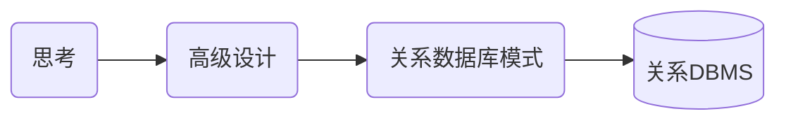
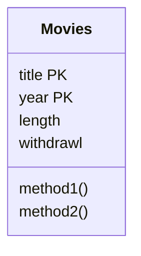

## 摘要

&ensp;&ensp;&ensp;&ensp;大学里学的数据库课程也差不多忘了（好像根本没怎么听，就只记得个笛卡尔积和几大范式了哈哈），所以就学习一下。当然，如果对离散数学没有任何认识的话还是建议先看离散数学，因为数据库中很多术语都在离散数学中有定义。

更新记录：  

- 2020-03-20： 开始记录
- 2020-03-26： 完成一、二、三章，把范式搞清楚就好办了
- 2020-03-27： 完成第四章，E/R图完成，第一部分理论就完成了，准备进入数据库程序设计部分。

<!-- more -->

## 第一章 数据库系统世界

&ensp;&ensp;&ensp;&ensp;本章节主要是介绍了一些关于数据库的基础概念。

### 1、数据库相关概念

- **数据库是什么？**
  
  本质上讲，数据库就是信息的集合。一般来讲，是指由DBMS所管理的数据的集合。  

- **关系型数据库与非关系型数据库区别**

  数据库系统将数据组织成表的形式呈现给用户，这种形式的数据表示称为关系。关系数据库就是采用了关系模型来组织数据的数据库。  

- **SQL是什么？**

  Structured Query Language，结构化查询语言，一种数据库查询和程序设计语言，用于存取数据以及查询、更新和管理关系数据库系统。

- **DB、DBMS、DBA是什么？**

  - DB：Database，即数据库
  - DBMS：Database Management System，即数据库管理系统。我们平时所说的mysql、mssql就是指的DBMS而不是DB
  - DBA：Database Administrator，即数据库管理员。是从事管理和维护数据库管理系统(DBMS)的相关工作人员的统称。

- **数据定义语言（DDL）是什么？**

  数据库模式定义语言DDL(Data Definition Language)，是用于描述数据库中要存储的现实世界实体的语言。  

### 2、数据库管理系统

- **DBMS如何执行查询操作？**

  数据库查询通过查询编译器完成SQL语法的分析与优化，语法送往执行引擎完成一系列小块数据请求，请求送往缓冲区管理器完成从二级存储（通常是磁盘）获取数据送入主存缓冲区。

- **简单了解数据库事务**

  事务是数据库管理系统执行过程中的一个逻辑单位，由一个有限的数据库操作序列构成。

- **事务的ACID是什么？**

  A(atomicity)：原子性，事务操作要么全部执行，要么全部不执行  
  I(isolation)：独立性，事务执行时如同没有其他事务同时执行一样。  
  D(durability)：持久性，一旦事务完成，该操作对数据库的影响是永久的。  
  C(consistency)：一致性，事务完成前后数据的完整性必须保持一致。  

## 第二章 关系数据模型

### 1、名词解释

- **数据模型(Data Model)**：数据模型一般用于描述数据库中数据的结构,也包含施加于数
据上的各种约束。通常，数据模型提供了一套规则描述數据上的各种操作，比如数据查
询和数据修改。

- **关系模型(Relational Model)**：关系是表示信息的表。属性位于每列的头部，每个属性
都有相应的域或者数据类型。行被称为元组，每一行都有一个分量与关系属性对应。

- **模式(Schema)**: 关系名和该关系所有属性的结合。多个关系模式形成一个数据库模式。
一个关系或多个关系的特定数据叫做关系模式或数据库模式的实例。

- **键(Key)**：关系上有一类很重要的约束，即由关系的一个属性或者一个属性集组成的
键。没有任何两个元组在组成键的所有属性上具有相同的值，虽然它们有可能在组成键
的部分属性上取值相同。

- **半结构化数据模型(Semistructured Data Model)**：在这种数据模型中，数据以树或者图的形式进行组织。XML是半结构化数据模型中的一个重要实例。

- **SQL**：SQL是关系数据库系统的标准查询语言。最新的标准是SQL-99。目前市面上的商
用数据库并没有完整的实现该标准，而只是实现了其中的一部分。

- **数据定义(Data Definition)**: SQL提供了定义数据库模式中元素的语句，可以利用
CREATE TABLE语句来声明一个存储的关系 (称作表)模式，定义其包含的属性集，各
属性的数据类型、默认值和键等。

- **模式修改(Altering Schema)**：可以利用ALTer语 句来修改数据库的一部分模式。 这些修
改包括在关系模式中增加或者删除属性，改变与某个属性相关联的默认值等。当然，
也可以利用DROP语句将整个关系或者其他模式元素删除。

- **关系代数(RelationalAlgebra)**：代数在关系模型的大多数查询语言中都有所体现。它
的基本操作有并，交、整、选择,投影、笛卡儿积、自然连接、链接及重命名等。

- **选择和投影(Selection and Projection)**：选择操作得到的结果是关系中所有满足选择条
件的元组。投影操作从关系中去掉不感兴趣的列，剩下的输出，形成最终结果。

- **连接(Join)**：通过比较两个关系的每一对元组来进行连接操作。在自然连接当中，把
那些在两个关系的共有属性上值相等的元组接合起来。在θ连接中，则是连接来自两个
关系的一对满足θ连接指定的选择条件的元组。

- **关系代数中的约束(Constraint in Rclational Algcbra)**: 许多常见的约束可以用某个关系
代数表达式被另外一个所包含的形式表达，或者用某个关系代数表达式等于空集的等价
形式表达。

### 2、数据模型

数据模型是用于描述数据或信息的标记，一般由三部分组成：

- 数据结构：一种物理数据模型，也称概念模型
- 数据操作：有限的可执行操作集，如CRUD。
- 数据约束：描述数据上的关系约束。

主流数据模型有：

- 关系模型
- 半结构化模型

### 3、关系模型

数据库表Movies

| title              | year | length | genre  |
| ------------------ | ---- | ------ | ------ |
| Gone with the wind | 1939 | 231    | drama  |
| star wars          | 1977 | 124    | scifi  |
| wayne's world      | 1992 | 95     | comedy |

以上面的关系为例：

- **关系名**：就是表名Movies
- **属性**：关系的列名如title、year等，由于关系上所有的属性是一个集合而不是列表，因此与排列顺序无关。
- **模式**：关系名和数据的集合构成的组合。如：Movies(title、year、length、genre)
- **数据库模式**：多个关系模式组成的集合。
- **元组**：每一行数组，如：(Gone with the wind, 1939, 231, drama )，由于关系是元组的集合，因此与元组的排列顺序也无关。
- **域**：元组的每个分量具有原子性，属于某种元素类型，如year属于integer，即为year分量上的域。
- **实例**：当前关系所有元组的集合称为当前实例。
- **键**：关系上的任何两个元组的值在键上的取值不同，比如我们平时说的主键id，也可以由多个属性结合成键，如这里的title和year可以组成成键。

### 4、代数查询语言

#### 什么是代数

  &ensp;&ensp;&ensp;&ensp;通常一门代数由一些操作符合一些原子操作数组成。如算数代数中的原子操作数是x和15这种，+、-、*、/这些是操作符。任何一门代数都可以把操作符作用在原子操作数上构造表达式。

#### 为何引入代数查询语言

  &ensp;&ensp;&ensp;&ensp;C++/JAVA这些语言已经足够强大，为何还要引入新的语言？答案非常让人惊讶，引入关系代数的原因竟然正是由于关系代数没有C++/JAVA这么强大的特性。在数据库中，我们使用一些简单的代数符号就可以用来表达我们对数据的所有操作。

#### 关系代数

- 操作数:
  - 代表关系的变量
  - 代表有限关系的常量
- 操作符：
  - 集合操作  
      交：$R∩S$  
      并：$R∪S$  
      差：$R-S$  
  - 投影（$π$）  
      其实就是过滤了一些属性得出的结果，  
      例如：$ π_{title,year,length}(Movies) $，就是把title、year、length这三列拿出来。  

      | title              | year | length |
      | ------------------ | ---- | ------ |
      | Gone with the wind | 1939 | 231    |
      | star wars          | 1977 | 124    |
      | wayne's world      | 1992 | 95     |

  - 选择($σ$)  
      就是过滤了一些元组得出的结果：  
      例如：$ σ_{length\geq100}(Movies) $ 的结果是：  

      | title              | year | length | genre  |
      | ------------------ | ---- | ------ | ------ |
      | Gone with the wind | 1939 | 231    | drama  |
      | star wars          | 1977 | 124    | scifi  |

  - 笛卡尔积($×$)  
      笛卡尔积又叫叉积或者直接叫积，是一个有序对的集合。就是把两个关系的元组拼在一块，组成更长的元组。例如：  
      R：

      |A|B|
      |-|-|
      |1|2|
      |3|4|

      S：

      |A|B|C|
      |-|-|-|
      |2|5|6|
      |4|7|8|
      |9|10|11|

      R×S：

      | A | R.B | S.B | C  | D  |
      | - | --- | --- | -- | -- |
      | 1 | 2   | 2   | 5  | 6  |
      | 1 | 2   | 4   | 7  | 8  |
      | 1 | 2   | 9   | 10 | 11 |
      | 3 | 4   | 2   | 5  | 6  |
      | 3 | 4   | 4   | 7  | 8  |
      | 3 | 4   | 9   | 10 | 11 |

      **所以一个m行元组的R和一个n行元组的S的笛卡尔积有m*n个元组。**
  - 自然连接(join，$R⋈S$)  
      关系R和S中具有共同属性，且共同属性中值相等的元组配对构成新元组，可以一对多。
  - θ连接($R⋈{ _c}S$)  
      其实就是带筛选条件的自然连接。
  - 命名和重命名($ρ_{_{RS}(x, y, z)}(R×S)$)  
      将关系代数生成的结果重新命名

## 第三章 关系数据库设计理论(含范式判断)

&ensp;&ensp;&ensp;&ensp;本章主要介绍关系模式中的由于存在依赖导致的问题，以及如何用范式分解去解决问题。

### 1、名词解释

- **函数依赖(Functional Dependency, FD)**：函数依赖表示:若关系中的两个元组在某些属性
集合上一致，则它们在另-些属性集合上也必须一致。

- **关系的键(Key of a Relation)**： 关系的超键(superkey) 是可以函数决定该关系所有属
性的属性集合。若一个超键不存在任何能函数决定所有属性的真子集，则它是键。

- **函数依赖的推论(Reasoning About Functional Dependency)**: 存在一组规则，根据这些
规则可以推出在满足給定FD集的任意关系实例中，FD X→A成立。证明FD X→A成立的方法是计算X的闭包，使用给定FD来扩展X，直到它包含A.

- **FD集合的最小基本集(Minimal Basis for a set of FD's)**：对于任何FD集合，至少有一个
最小基本集，它是一个和原FD集合等价的FD集合(即两者相互蕴涵),右边是单个属性，
而且从中去除任一一个FD或从左边去除任一个属性后都不再和原集合等价。

- **Boyce-Codd范式(Boyce Codd Normal Form)**：若关系中的非平凡FD指明某个超键函数
决定一个或其他多个属性，则该关系属于BCNF。BCNF的主要优点是它消除了由FD引起的冗余。

- **无损连接分解(Lossless-Join Decomposition)**： 分解的一个有用性质是可以通过将分解得到的关系进行自然连接，来准确地恢复原始关系。任何一个分解都包含了原关系的所有元组，但若分解选择不当，则连接结果会包含不属于原关系的元组。

- **依赖保持分解(Dependency -Preserving Decomposition)**：分解的另一个很好的性质是可以通过检查在分解得到的关系上的FD来证明原关系上的所有函数依赖。

- **第三范式(Third Normal Form)**： 有时，分解到BCNF时无法具有依赖保持性质。3NF是
一种比BCNF限制较松的范式，它允许FD X一A (其中X可以不是超键，而A是键的成
员)的存在。3NF不保证消除所有由FD引起的冗余，但大多数情况下可以消除。

- **多值依赖(Multivalued Dependency, MVD)**：多值依赖表示关系中有两个属性集的值以所有可
能的组合方式出现。

- **第四范式(Fourth Normal Form)**：关系中的MVD也可能引起冗余。4NF同BCNF相似，
但也禁止存在左边不是超键的非平凡MVD。一个关系可以无损地分解为4NF关系集台。

### 2、函数依赖

#### 函数依赖的定义

||A1|...|An|B1|...|Bm|-|
|-|-|-|-|-|-|-|-|
|t|-|-|-|-|-|-|-|
|u|-|-|-|-|-|-|-|

&ensp;&ensp;&ensp;&ensp;如上图所示，如果t、u两个元组在属性$A_1...A_n$上的值完全相同，那么他们在$B_1...B_m$上的分量值也相同，则存在函数依赖。该函数依赖形式可以记为：$A_1A_2...A_n→B_1B_2B_...B_m$，称“$A_1A_2...A_n$函数决定$B_1B_2B_...B_m$”。如果关系R中每个实例都能使一个给定的FD为真，则称R满足函数依赖$f$。通常一个FD的右边可能是单个属性，所以$A_1A_2...A_n→B_1B_2B_...B_m$也等价于：  

$$
A_1A_2...A_n→B_1\\
A_1A_2...A_n→B_2\\
...\\
A_1A_2...A_n→B_m\\
$$

- **完全依赖**：若属性集A决定B，且去除任何一个A集合中的属性后属性集A无法决定B，那么称其为完全依赖。
- **部分依赖**：若属性集A决定B，且去除某个A集合中的属性后属性集A仍然可以决定B，那么称其为部分依赖。

#### 键、超键、候选键

- **关系的键**  
  一个或多个属性集满足下面的条件：  
  1. 这些属性决定其他属性，即不存在两个元组具有相同的键
  2. 属性集$\{A_1,A_2...A_n\}$中没有任何属性都不能被其他属性或属性集所决定，即键是最小的。

  键也称为候选键

- **超键**  
  超键满足键的第一条规则，但是不满足第二条，因为超键不需要最小化，即属性集中只要包含了键中所有的属性就可以称为超键。超级键嘛，肯定要比键多啦。

#### 函数依赖规则

- **依赖推导**  
  通过一系列的推导规则，如传递规则，从而推断出新的FD集合。对于两个FD集合S和T，若他们的FD集合集合完全相同，则认为S与T等价，若满足T中所有FD的每个关系实例也满足S中的所有FD，则认为S是从T中推导出来的。

- **结合/分解**  
  FD的右边可以结合，也可以分解：
  分解：一个FD右边有多个属性时可以分解成左边相同，右边为单个属性。
  结合：多个FD左边相同，右边可以结合为多个属性。
  **注意：** FD的左边不能分解，因为分解后推导可能存在条件不充分的情况而导致错误。

- **平凡函数依赖**  
  FD的右边是左边的子集，则称为平凡FD。如$title, year → title$，即为平凡FD。存在一种中间状态，右边部分属性在左边出现，部分没有出现，那么可以把右边在左边出现的部分删除，以此进行FD化简，这种化简规则称为平凡依赖规则。

- **闭包**  
  即以FD左边的属性集为基础，利用这些属性集的组合进行FD推导（FD集合需要给出），能推出不在这里面的属性，并把这些属性加入到左边的属性集中，最终得出属性集的闭包。按平凡依赖规则，左边的属性集肯定能推出他自己，所以闭包的表示为：$\{A_1,A_2,...A_n\}^+$ 当$A_1,A_2,...A_n$是关系的超键时，$\{A_1,A_2,...A_n\}^+$为关系的所有属性的集合。

- **传递规则**  
  这个就简单了，就是如果有FD：A→B，B→C，那么也有：FD：A→C。当然，这里的A、B、C泛指集合，如果C中存在某些属性在A中出现，则可以利用平凡依赖规则将这些元素除去。
  
### 4、数据库模式设计

&ensp;&ensp;&ensp;&ensp;不好的数据库模式会带来冗余和相应的异常，因此一个良好的关系模式非常重要。一般都是引入范式进行分解。

#### 异常

&ensp;&ensp;&ensp;&ensp;当一个关系中包含过多信息时，会产生冗余等问题，称之为异常，异常的基本类型有：

- **冗余**：信息在多个元组中重复。
- **更新异常**：修改了某个元组中的信息却没有改变其他元组中相同的信息。
- **删除异常**：删除某元组集后导致某些属性信息丢失。

#### 分解

&ensp;&ensp;&ensp;&ensp;一般使用分解的方法来消除异常，分解应具有以下性质：

- **消除异常**：消除冗余、更新异常、删除异常
- **信息的可恢复**：可以从分解后的元组中恢复原始关系
- **依赖的保持**：分解后的关系进行连接重构获取的原始关系仍然满足原来的FD

#### chase检验

&ensp;&ensp;&ensp;&ensp;由于分解不能保证分解的各个关系重新连接后能得到原关系实例（就是说分解后的关系进行**自然连接**时得到的元组会比原来的多了或者少了），所以分解也分为无损连接和有损连接两种。chase检验就是用来检验分解是否是无损连接的。

算法举例：
假设有关系R(A,B,C,D)被分解为3个关系S1(A,D),S2(A,C),S3(B,C,D)。可以用以下图例来表示分解关系：

|A|B|C|D|
|-|-|-|-|
|a|b1|c1|d|
|a|b2|c|d2|
|a3|b|c|d|

每一行代表一种关系划分，加下标的值代表可以为任意值。假定分解给定的FD是A→B，B→C，CD→A。下面进行等值替换操作。

1. 由于第一行和第二行均有相同的A值为a，考虑FD：A→B，故有b2=b1，则可替换b2为b1，得：

    |A|B|C|D|
    |-|-|-|-|
    |a|$\color{#fbbc05}{b1}$|c1|d|
    |a|$\color{#fbbc05}{b1}$|c|d2|
    |a3|b|c|d|

2. 由于第一行和第二行均有相同的B值为b1，考虑FD：B→C，故有c1=c，则可替换c1为c，得：

    |A|B|C|D|
    |-|-|-|-|
    |a|b1|$\color{#fbbc05}{c}$|d|
    |a|b1|$\color{#fbbc05}{c}$|d2|
    |a3|b|c|d|

3. 再由于第一行和第三行均有相同的CD值为cd，考虑FD：CD→A，，故有a3=a，可替换a3为a，得：

    |A|B|C|D|
    |-|-|-|-|
    |$\color{#fbbc05}{a}$|b1|c|d|
    |a|b1|c|d2|
    |$\color{#fbbc05}{a}$|b|c|d|

由于第三步之后没有值可应用FD进行替换，且出现了一行与元组(a,b,c,d)相匹配（即出现了一行不带下标的元组）。因此必为无损，反之为有损。

**思考：为什么chase检验有效？**  

&ensp;&ensp;&ensp;&ensp;其实我们每次FD替换就相当于进行了连接操作，最后得出的元组(a,b,c,d)就是原始关系。所以能找出这个元组就是能还原原始关系了，如果找不出说明这个分解的关系都没法还原那肯定是有损的了。（之前我还有点不明白，如果出现多的怎么办呢？写到这里才幡然醒悟，根本不会存在多的情况，这个要和有损连接中出现多的数据区分开来，这里讨论的是关系。）

**思考：为什么无损连接和依赖保持不能同时存在？**  

&ensp;&ensp;&ensp;&ensp;(这里我也学的不是很明白，书上只是给了一个例子，但是并没有给出证明过程，为什么这个例子不能是偶然的呢？挖坑，希望大佬解答。)

#### 多值依赖MVD

&ensp;&ensp;&ensp;&ensp;多值依赖一般是出现在基于A属性两个独立属性集B，C合并在单个关系中。 其定义：
对于R中每个在所有A属性上一致的元组对t和u，能在R中找到满足下列条件的元组v:

1. 在A属性上的取值与t和u相同:
2. 在B属性上的取值与t相同:
3. 在R中不属于A和B的所有其他属性上的取值与u相同。

说白了就是关系内存在多对多的关系，这个用第四范式解决即可。

### 5、范式综合

&ensp;&ensp;&ensp;&ensp;范式，NF(Normal Form)。这里简要说明一下各范式的定义，详解再结合例子单独写一篇，因为这个范式分解在数据库中的地位还是很高的。注意六大范式中的BCNF为什么不叫4NF呢，因为BCNF是对3NF的加强，可以理解为3NF Plus。

**1NF：**

概念：关系中的每个属性都不可再分（消除非主属性对码的部分函数依赖）。  
人话：就是表头属性是一行的，不存在你在excel表里面弄个两行然后某个属性再分解一下有两种类别这样。如下就不是1NF：

|标题| > |标识|
|-|-|-|
|-|类别|标签|
|这是标题啊|默认分类|测试标签|

**2NF：**

概念：在满足1NF的基础上，非主属性必须完全依赖于候选码（在1NF上消除非主属性对码的传递函数依赖）。  
人话：就是非主属性必须完全依赖主键属性，由于主键属性可能由多个属性组成，如果去除主键属性中某些属性后，主键属性仍然可以决定非主属性，那么就不是2NF。

**3NF：**

概念：在满足2NF的基础上，任何非主属性不依赖于其它非主属性（在2NF基础上消除传递依赖）。  
人话：设主属性为A，存在非主属性B、C（B不是A的子集），若存在A→B，B→C，那么就不是3NF。

**BCNF：**

概念：在满足第三范式（3NF）基础上，任何非主属性不能对主键子集依赖（在3NF基础上消除主属性对候选码的部分函数依赖和传递函数依赖）。  
人话：就是说主键属性之间也要独立，不能由某些属性决定某些属性。

**4NF：**

概念：是Boyce Codd范式，并且没有多值依赖关系（在满足BCNF的基础上，消除非平凡且非函数依赖的多值依赖）。  
人话：就是删除关系内的多对多关系。

**5NF：**

概念：在4NF中并且不包含任何连接依赖关系并且连接应该是无损的，关系模式R依赖均由R候选码所隐含。（4NF的基础上，消除不是由候选码所蕴含的连接依赖）。  
人话：就是关系之间的连接完全由主键决定，不存在其他的键与其他关系之间存在连接。

## 第四章 高级数据库模型(含E/R图)

首先我们来看一下数据库从设计到实现的过程：



本章节主要就是讲何如设计数据库模型并能应用到关系数据库中。主要是使用了UML（统一建模语言）和E/R图（实体-联系图）对数据库关系进行设计。

### 1、名词解释

- **实体-联系模型(the Entity. Relationship Model)**:在E/R模型中 描述了实体集、实体集
之间的联系以及实体集和联系的属性。实体集的成员叫做实体。
- **实体-联系图(Entity-Relationship Diagram)**:分别用矩形、菱形和椭圆来画实体集、联
系和属性。
- **联系的多样性(Multiplicity of Relationship)**:二元联系可以是一-对一、多对一或多对多。
在一对-联系中，两个实体集中的任-一个实体至多只能与另-一个实体集中的一个实体关
联。在多对- -联系中，“多”边的每个实体至多只能与另-边的-一个实体关联。多对多
联系对个数无约束。
- **好的设计(Good Design)**:高效地设计数据库需要忠实地表达现实世界，选择合适的元
素(如联系、属性)，避免冗余一冗余是指一 -件事表示了两次，或者是用- -种间接的
或者是用过度复杂的方式表示一件事。
- **子类(Subclass)**: E/R模型用一个特殊的联系isa表示-一个实体集是另一个实体集的特例。
实体集可能连接在- -个层次体系中，其中每个子节点都是其父节点的特例。只要子树包
含根，那么实体集就可以有属于此层次的任意子树的组成部分。
- **弱实体集(Weak Entity Set)**: 需要用支持实体集的属性来确定它自己的实体。使用双边
的矩形和菱形来区分弱实体集。
- **统一建模语言(Unified Modeling Language)**: 在UML中，描述类和类之间的关联。类
好比E/R实体集，关联好比二元的E/R联系。特殊的多对一联系称为聚集和组合，并且这
些联系暗含了它们是如何转化为关系的。

- **对象定义语言(Object Definitive Language)**: 该语言用面向对象方式描述数据库的模式
设计。用户可以定义类，它有三种特性:属性、方法和联系。
- **ODL联系(ODL Relationship)**: ODL中的联系必须是二元的。它在其连接的两个类
(关联的两端)中通过名字来声明(同时声明其反向联系)。联系可以是多对多、多对一
或者一对一，取决于联系的类型是被声明为单个对象还是对象的集合。
- **ODL的类型系统(The ODL Type System)**: ODL允许构建类型，从类名和原子类型开始，
使用类型构建器为:结构、集合、包、链表、数组和字典等。

### 2、E/R模型

#### E/R图的基本标注

在实体-联系(Entity-relationship model，或er模型)模型中，数据的结构用图形化方式表示，即“实体-联系图”，用到**实体集**、**属性**、**联系**三个元素类型。  

- **实体集**
  实体是某种抽象对象，相似实体的集合形成实体集。这里的实体和编程中的“对象”非常相似，但是这个实体是静态的，不具有数据操作的功能，可以想象成只有属性没有方法的对象。并且在E/R图中我们使用**矩形**来表示实体集。  

- **属性**
  实体集具有属性，属性是这个实体集中所具有的性质，可以想象成对象中的属性，差不多了，在E/R图中我们使用**椭圆**来表示属性。

- **联系**
  联系是两个或多个实体集的连接，类似于一对一、一对多、多对多的连接关系，不过E/R图中的联系是有那么点多对多中的中间表的味道，可以单独拿出来命名。在E/R图中我们使用**棱形**来表示实体之间的联系。

- **角色**
  实体集和实体集之间用边连接，这个边称之为“角色”，有时候在多路联系的情况下，我们需要给边命名，以此表示清楚实体集与实体集或实体集与自己本身的关系。边的末端可能会出现箭头，这个箭头表示这一端**最多只能存在一个**。

- ***E/R图基本示例***

  ```mermaid
  graph TB;
  A[Stars]---D{Contracts};
  B[Movies]---D;
  D-- Studio of star -->C[Studios];
  D-- Producing studio -->C[Studios];

  a1([title])---A;
  a2([year])---A;
  a3([length])---A;
  
  b1([name])---B;
  b2([address])---B;

  C---c1([name]);
  C---c2([address]);
  ```

#### 设计原则

- **忠实性**：设计应当忠实于应用的具体要求。就是说建模原则是要符合现实世界规则，总不可能真把三头六臂插在人身上吧，这比喻也不是很恰当，头和臂是属性的话，三、六就是数据了，那后期装个机械手臂也是可以的啊哈哈。换个比喻，你对花草树木建模，那就不能说他拥有头了吧。

- **避免冗余**：应当小心对每件事只说一次（我觉得这书里面很多翻译真的很头疼啊）。前面好像也介绍过很多关于冗余的事了，这里不再重复了，“避免冗余”这个字面意思挺好理解的。

- **简单性**：除非有绝对需要，不要在你的设计中添加更多的成分。

- **选择正确的关系**：实体集可以用可以用多种联系连接起来，但是不要把每种可能的联系都写进来。

- **选择正确的元素种类**：对于特定的情形，有的东西适合做实体，有的东西适合做属性，不要搞混，不然会出现异常。例如本书中的电影公司就适合做实体，如果做属性会出现更新异常或者删除异常。

#### E/R图标注进阶

- **isa子类联系**
  在E/R图中，可以使用isa作为一种子类联系。我们使用三角形来表示。（mermaid语法画不了三角形图，我这里就不举例了，书上看看吧，就是把联系的棱形改为三角，然后名字都是isa）。子类的作用就自行联系面向对象中的子类吧。

- **键**
  每个实体集必须有一个键，一个实体集可以有多个键，isa中根实体集有用键所需的所有属性。这里我们对属性使用下划线来表示。

- **引用完整性**
  假设R是从实体集E到实体集F的联系，用圆箭头指向F，表示此联系从E到F中F实体必须存在。

- **度约束**
  在实体和联系的边上加上一个数字表示相关实体集中数目的约束，当然，可以用判断符号，如“<=10”。

- **弱实体集**
  一个实体集键由另一个实体集的部分或全部属性构成，这样的实体集称为弱实体集。我们用**矩形套矩形**的图形来表示这种实体集，边上的联系用**棱形套棱形**的图形表示（禁止俄罗斯套娃！！！）。例如：一个电影公司有几套拍摄班子命名为A、B、C，但是其他公司也有可能用同样的方式命名A、B、C，这时候命名不能作为拍摄班子的键，必须要同时给出电影公司才能确定一套拍摄班子，称这样的实体集为弱实体集（很作是吧，但是转换到数据库表里面我们用一个id主键就能把他变成非弱实体集，id还是万金油啊）。

#### E/R图到关系设计

初看起来，把er设计转换为关系数据库模式很直观:  

- 每个实体集可以转化为具有相同属性集的关系;
- 联系也用关系替换，替换的关系属性就是联系所连接的实体集的键集合。

虽然这两条规则在大多数情况下可用，但仍要考虑下面几种特殊情况:  

1. 弱实体集不能直接转化为关系。
2. “isa” 联系和子类要特殊对待。
3. 有时，需要把两个关系组合为一个关系，特别是当-个关系是从实体集E转化形成，而
另一个关系是由E到其他实体集的一个多对一的联系转化而来时，要考虑这种组合。

下面讨论关系的具体转换：

- **实体集**：直接把关系名和属性写出来，比如Stars(name, address)。
- **联系**：把联系两端的键以及联系自身的属性放一块，关系名就是联系名，如果出现属性重复，那就重新命名，比如name→studio_name。
- **关系组合**：有时候按照上面两种方法出来的关系可能不是很好，存在查询效率低的问题，这种情况经常出现在多对一和一对一的情况。这时我们可以把一的一边的主键放到多的一边而不需要再建立一个中间表降低查询效率了。
- **弱实体集**：当E/R图中有一个弱实体集时，需要做下面三件不同的事:
  1. 从弱实体集W得到的关系不仅要包含W的属性，还要包含相应支持实体集的键属性。支
  持实体集很容易辨认，因为它们由从W引出的支持联系(双边菱形)连接。
  2. 与弱实体集W相连的联系，经转化后所得的关系必须包含W键属性，以及对W键有贡献
  的实体集属性。
  3. 然而，一个支持联系R (它是从弱实体集W指向支持实体集)不必被转化为关系，因为由多对一联系R转化得到的关系的属性可以是W的属性，也可以与W的关系模式进行组合(在R有属性的情况下)。
- **isa子类**：isa子类转换有三种观点：
  1. 遵照er观点：即父类子类都创建关系，子类要包含父类的键，如B、C是A的子类，那就创建A、B、C三个子类，而且B、C中有A的键。
  2. 把实体看做属于单个类的对象：就是每个类都创建一个关系，父类子类都要，而且重复的子类还得加起来弄一个，并且子类拥有父类的所有属性。
  3. 使用空值：就是父类子类属性放一块，然后没有的属性给null就行了。
  以上三种方法各有各的优缺点，有的冗余多，有的查询效率高，就看实际应用选择了。

### 3、UML建模

#### UML简介

&ensp;&ensp;&ensp;&ensp;UML (统一建模语言，Unified Modeling Language)最初是开发用来在面向对象风格中作为描述软件设计的一种图形化的标注。它现在已经做了一些扩展和更改，可以作为一种流行的数据库设计描述的标注。

#### UML标注

&ensp;&ensp;&ensp;&ensp;UML中的类与er模型中的实体集类似，但是图形标注上有很大差别。如下图显示了与er实体集Movies对应的类。一个类框分为三个部分。顶部是类的名字，中间是它的属性，就像是一个类的实例变量一样。在Movies类中，有title, year, length和genre属性，属性后面加PK代表键。底部是方法。er模型和关系模式都不提供方法。然而这是一个重要的概念，通常出现在现代的关系系统中，称作“ 对象关系”DBMS。



#### UML关联

- **普通关联**：两个类之间画条线，联系名写线下面。连接端点用两个数字如`0..*`表示这端的对象数量约束上下限。`*`表示无限制，没有标签代表`1..1`，注意两个端点都要写。如下图：

  ```mermaid
  classDiagram
    Studios "0..1" -- "0..*" Movies : Owns
    Stars "0..*" -- "0..*" Movies : Stars-in
  ```

注意这里的数量约束已经表达了我们前面说的E/R图中的弯箭头的完整性约束。

- **自关联**：一个关联的两端可以连接同一个类，这样的关联称为自关联。为了区分一个他在自关联中表现的不同角色，还要给两端分别起个不同的名字。

- **关联类**：在两个类之间的线上加一个类，就称作关联类，和E/R图的也很类似。
- **子类**：UML允许一个类C有4个不同的子类：
  1. 完整对局部(Complete versus Partial)。 每个在类C中的对象是否是某个子类的一个成员?如果是，子类是完整的;否则，它们是局部的或者不完整的。
  2. 分离对重叠(Disjoint versus Overlapping)。 子类是分离的(Disjoint) (一个对象不能在两个子类中)吗?如果-一个对象可以在两个或多个子类中，那么子类可以称为是重叠的(Overlapping)。

  简单来说，完整对局部，说的就是父类和子类的关系，一般父类的对象可能是局部的，子类对象是完整的，因为父类可能会少一些子类的属性。分离对重叠就是子类和子类之间的关系，如果一个对象可以被两个子类表达那就是子类重叠（设想一下属性相同而方法不同？）。  
  子类的表示方法为：连一条线到父类，在父类端画个空三角箭头。

#### 聚集与组合

&ensp;&ensp;&ensp;&ensp;对于多对一的关联有两个特殊的标记，它们的含义相当微妙。--方面，它们影响了面向
对象的编程风格，通常对于一个类在它的属性之间都有到其他类的引用。另一方面，这些特殊的标注确实约束图如何转化为关系。

- **聚集(aggregation)**：在两个类之间的一条线，这条线的末端是一个空的菱形。菱形的含义是那端的标注一定要为0..1， 也就是说，聚集是-一个从这端的类到菱形端类的多对一的关联。尽管聚集是一个关联，但不必对它命名，因为名字在关系的实现中不会被用到。
- **组合(composition)**：与关联相似，但在菱形端的标注一定要为1..1。 也就是说，与菱形对应相连的类的每个对象都要与菱形端的-一个对象相连接。组合的菱形是实心的黑色。
  如下图：

  ```mermaid
  classDiagram
  classA "1..*" --o classC : aggregation
  classB "0..1" --* classD : composition
  ```

### 4、UML图到关系设计

- **类**：对于每个类，创建一 个关系，关系的名为这个类的名字，关系的属性就是这个类的属性。
- **关联**：对于每个关联，创建-一个名字为关联名的关系。关系的属性是两个连接类的键属性。如果恰巧两个类的属性名字相同，那么适当地重命名它们。如果有一个关联类附在这个关联上，那么在这个关系的属性中包含那个关联类的属性。
- **子类**：如果层次的每一层都是分离的，那么建议使用面向对象方法。如果层次在每一层既是完整的又是分离的，那么任务相对简单。如果使用面向对象的方法，那么只要为层次中叶子节点的类构建关系。如果层次很大并且在某些或者所有的层上是重叠的，那么er方法是合适的。可能会需要很多的关系使得关系数据库模式变得臃肿。
- **聚集与组合**：聚集与组合都是多对一类型的关联，在关系数据库模式中表示它们的方法可以是像普通关联做的那样进行转换。但是有些聚集与组合的实现会特殊一点，比如非棱形端是一个类的子类。所以建议聚集与组合用如下方式处理：不为聚集与组合构建任何关系，为非菱形端的类添加菱形端类的键属性。在聚集情况下(不是组合),这些属性可以为空。
- **弱实体集**：在UML的标注中没有提到与er模型中双边标注相对应的弱实体集。其实没有什么必要。
原因是，与er不同，UML遵循面向对象系统的传统，每个对象都有自己的对象标识。所以化关系的时候和关联化关系没啥区别。如果一定要标识一下，那就拿出来做个类，然后在端点加个小方块写上PK二字即可。

### 5、ODL语言

&ensp;&ensp;&ensp;&ensp;ODL (对象定义语言，Object Definition Language)是- -种基于文本的使用面向对象术语描述数据库结构的语言。像UML一样，类是ODL中的核心概念。就像UML类一样, ODL中的类具有名字、属性和方法。联系与UML的关联类似，但是在ODL中它不是一个独立的概念，而是可以作为特征的附加成员嵌入到类中。  
&ensp;&ensp;&ensp;&ensp;这个东西和编写模型代码类差不了多少，这里就不多BB了。

## 待完成

- [ ] 第五章 代数和逻辑查询语言
- [ ] 第六章 数据库语言SQL
- [ ] 第七章 约束与触发器
- [ ] 第八章 视图与索引
- [ ] 第九章 服务器环境下的SQL
- [ ] 第十章 关系数据库的新课题
