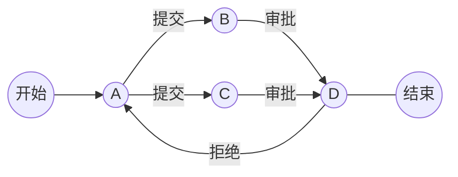

### 摘要

&ensp;&ensp;&ensp;&ensp;由于前几个月帮同学写了两个项目，其中涉及到了工作流的设计。比如，一个任务在发生什么操作之后应该要转到哪个用户进行下一步操作。如果只是单纯的更改数据库status字段肯定是不行的，耦合度太高，后续不容易维护，因此想到使用工作流(workflow)引擎。搜索资料发现java中是有activiti这样强大的引擎，但是目前Python中好像并没有发现比较好的。所以最后就找到这个Transitions库，比较简单，而工作流抽象出原理其实就是大学编译原理所学的状态机，因此我们用它来实现相关操作。

<!-- more -->

### 问题分析

假设我们有一个审批流程，现在由A发起，同时需要B、C进行审批，B、C审批完成之后由D审批结束。如果D不同意则驳回A重新提交。流程图如下：



像这种状态，我们肯定是可以通过修改数据库字段来进行的，但是不便于维护，那么我们该如何规范化实现呢？

### 工作流介绍

#### 顺序工作流

顺序工作流的执行过程是一个连续的步骤序列，它在完成一个活动之后会自动去执行到下一个。这种工作流就类似我们提交某些操作时需要进行系列步骤一样。

#### 状态机工作流

事件驱动工作流则依赖外部事件来驱动执行直到完成，事件驱动工作流也叫做状态机(state machine)工作流。状态机中包含一系列状态(包括初始状态和结束状态)和事件.状态机总是停在一个预设的状态中,直到事件触发之后才会跳转到新的状态上.状态机工作流这样做的好处就是它可以定义状态，定义工作流如何从一个状态到另外一个状态。下面介绍状态机。

### 状态机
有限状态机（Finite-state machine, FSM），又称有限状态自动机，简称状态机，是表示有限个状态以及在这些状态之间的转移和动作等行为的数学模型。FSM是一种算法思想，简单而言，有限状态机由一组状态、一个初始状态、输入和根据输入及现有状态转换为下一个状态的转换函数组成。现实世界中存在大量具有有限个状态的系统：钟表系统、电梯系统、交通信号灯系统、通信协议系统、正则表达式、硬件电路系统设计、软件工程，编译器等，有限状态机的概念就是来自于现实世界中的这些有限系统。


有限状态机是一个五元组M=(Q,Σ,δ,q0,F)，其中：
- Q={q0,q1,...,qn}是有限状态集合。在任一确定的时刻，有限状态机只能处于一个确定的状态qi；
- Σ={σ1,σ2,...,σn}是有限输入字符集合。在任一确定的时刻，有限状态机只能接收一个确定的输入σj；
- δ:Q×Σ→Q是状态转移函数，在某一状态下，给定输入后有限状态机将转入状态迁移函数决定的一个新状态；
- q0∈Q是初始状态，有限状态机由此状态开始接收输入；
- F⊆Q是最终状态集合，有限状态机在达到终态后不再接收输入。

### 状态机实现

1. 选择结构实现
   
   就是使用switch-case或if-else进行实现，这样当状态转移比较少的时候确实可以方便实现，但是代码可读性并不好，并且如果状态过多时状态机将难以扩展和维护。

2. 状态表实现
   
   维护一个二维状态表，横坐标表示当前状态，纵坐标表示输入，表中一个元素存储下一个状态和对应的操作。这一招易于维护，但是运行时间和存储空间的代价较大。
   
3. 面向对象实现
   
   这里直接放大神的代码给大家参考。
   statemachine.py
   ```python
   class StateMachine:
    def __init__(self):
        self.handlers = {}  # 状态转移函数字典
        self.startState = None  # 初始状态
        self.endStates = []  # 最终状态集合

    # 参数name为状态名,handler为状态转移函数,end_state表明是否为最终状态
    def add_state(self, name, handler, end_state=0):
        name = name.upper()  # 转换为大写
        self.handlers[name] = handler
        if end_state:
            self.endStates.append(name)

    def set_start(self, name):
        self.startState = name.upper()

    def run(self, cargo):
        try:
            handler = self.handlers[self.startState]
        except:
            raise ValueError("must call .set_start() before .run()")
        if not self.endStates:
            raise ValueError("at least one state must be an end_state")

        # 从Start状态开始进行处理
        while True:
            (newState, cargo) = handler(cargo)  # 经过状态转移函数变换到新状态
            if newState.upper() in self.endStates:  # 如果跳到终止状态,则打印状态并结束循环
                print("reached ", newState)
                break
            else:  # 否则将转移函数切换为新状态下的转移函数
                handler = self.handlers[newState.upper()]
   ```
   
   run.py
   ```python
   from statemachine import StateMachine

    # 有限状态集合
    positive_adjectives = ["great", "super", "fun", "entertaining", "easy"]
    negative_adjectives = ["boring", "difficult", "ugly", "bad"]


    # 自定义状态转变函数
    def start_transitions(txt):
        # 过指定分隔符对字符串进行切片,默认为空格分割,参数num指定分割次数
        # 将"Python is XXX"语句分割为"Python"和之后的"is XXX"
        splitted_txt = txt.split(None, 1)
        word, txt = splitted_txt if len(splitted_txt) > 1 else (txt, "")
        if word == "Python":
            newState = "Python_state"  # 如果第一个词是Python则可转换到"Python状态"
        else:
            newState = "error_state"  # 如果第一个词不是Python则进入终止状态
        return (newState, txt)  # 返回新状态和余下的语句txt


    def python_state_transitions(txt):
        splitted_txt = txt.split(None, 1)
        word, txt = splitted_txt if len(splitted_txt) > 1 else (txt, "")
        if word == "is":
            newState = "is_state"
        else:
            newState = "error_state"
        return (newState, txt)


    def is_state_transitions(txt):
        splitted_txt = txt.split(None, 1)
        word, txt = splitted_txt if len(splitted_txt) > 1 else (txt, "")
        if word == "not":
            newState = "not_state"
        elif word in positive_adjectives:
            newState = "pos_state"
        elif word in negative_adjectives:
            newState = "neg_state"
        else:
            newState = "error_state"
        return (newState, txt)


    def not_state_transitions(txt):
        splitted_txt = txt.split(None, 1)
        word, txt = splitted_txt if len(splitted_txt) > 1 else (txt, "")
        if word in positive_adjectives:
            newState = "neg_state"
        elif word in negative_adjectives:
            newState = "pos_state"
        else:
            newState = "error_state"
        return (newState, txt)


    if __name__ == "__main__":
        m = StateMachine()
        m.add_state("Start", start_transitions)  # 添加初始状态
        m.add_state("Python_state", python_state_transitions)
        m.add_state("is_state", is_state_transitions)
        m.add_state("not_state", not_state_transitions)
        m.add_state("neg_state", None, end_state=1)  # 添加最终状态
        m.add_state("pos_state", None, end_state=1)
        m.add_state("error_state", None, end_state=1)

        m.set_start("Start")  # 设置开始状态
        m.run("Python is great")
        m.run("Python is not fun")
        m.run("Perl is ugly")
        m.run("Pythoniseasy")
   ```

4. transitions开源库
   
　transitions是一个由Python实现的轻量级的、面向对象的有限状态机框架。transitions最基本的用法如下，先自定义一个类，然后定义一系列状态和状态转移（定义状态和状态转移有多种方式，下面只写了最简明的一种，具体要参考文档说明），最后初始化状态机。

    ```python
        from transitions import Machine


        # 定义一个自己的类
        class Matter(object):
            pass


        model = Matter()


        # 状态定义
        states = ['solid', 'liquid', 'gas', 'plasma']


        # 定义状态转移
        # The trigger argument defines the name of the new triggering method
        transitions = [
            {'trigger': 'melt', 'source': 'solid', 'dest': 'liquid'},
            {'trigger': 'evaporate', 'source': 'liquid', 'dest': 'gas'},
            {'trigger': 'sublimate', 'source': 'solid', 'dest': 'gas'},
            {'trigger': 'ionize', 'source': 'gas', 'dest': 'plasma'}]


        # 初始化
        machine = Machine(model=model, states=states, transitions=transitions, initial='solid')


        # Test
        print(model.state)    # solid

        # 状体转变
        model.melt()

        print(model.state)   # liquid

    ```


参考资料：

1. https://www.cnblogs.com/21207-iHome/p/6085334.html
2. https://blog.csdn.net/u010375663/article/details/43230561